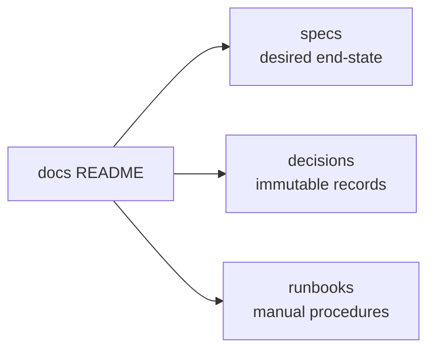

# xitter docs

All documentation for the project. No code lives under `docs/`.

| Directory    | Purpose                                                                                                   |
| ------------ | --------------------------------------------------------------------------------------------------------- |
| `specs/`     | Living documents describing the **desired end-state** of the system (never current state).                |
| `decisions/` | Decision records. Immutable once merged to `dev`/`main`; changes supersede via a new record.              |
| `runbooks/`  | Step-by-step manual procedures (setup, deploy, CI/secrets, content promotion). Idempotent where possible. |

## Conventions

- Specs are self-contained: they may reference other specs, nothing outside `specs/`.
  Everything else references specs rather than repeating them.
- Use Mermaid diagrams, tables, and other structured formats over prose walls.
- When a spec changes and creates a gap with reality, tickets are created to close the gap.
- Decision records use a consistent format: state, context, decision, options.
  They are immutable once merged to a protected branch (`dev`/`main`) — within
  an open PR they may be edited freely. After merge, a change in decision
  supersedes the old record with a new one.
- Runbooks use: context/intro, execution steps, validation steps.

## Spec areas

| Area           | Covers                                                                  |
| -------------- | ----------------------------------------------------------------------- |
| `architecture` | Technology, infrastructure, interfaces, technical flows                 |
| `product`      | Non-technical product information, rationale, strategy                  |
| `data`         | Schemas, pipelines, seeding, lifecycle                                  |
| `operations`   | Environments, resets, backups, releases, access (links out to runbooks) |
| `testing`      | Test strategy, suites, requirements, coverage gates                     |
