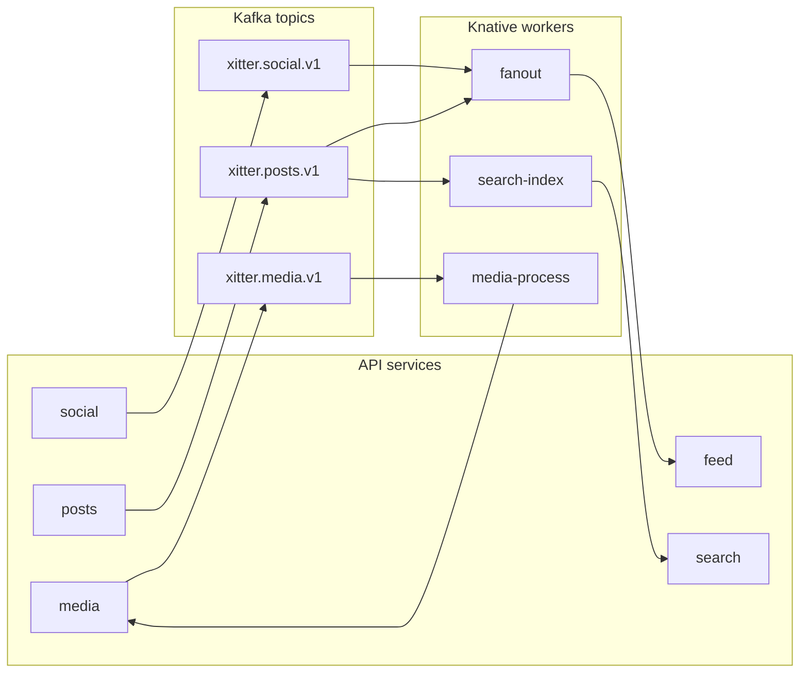

# ADR 0001: Microservice decomposition

## Status

Decided — 2026-08-15

## Context

xitter is a demo project whose primary goal is demonstrating a realistic microservices architecture (service boundaries, event-driven integration, independently deployable units). Microservices are chosen for learning and demo value — not for their own sake. The decomposition should be small enough to operate comfortably at demo scale, but rich enough to exercise the interesting patterns.

## Decision

Five API services plus three Knative workers:

| Component                | Responsibility                                                  |
| ------------------------ | --------------------------------------------------------------- |
| **social** service       | Profiles, follows, blocks                                       |
| **posts** service        | Posts and replies, and interactions (likes, bookmarks, reposts) |
| **media** service        | Uploads and generated image variants                            |
| **feed** service         | Materialised feeds + websocket updates                          |
| **search** service       | OpenSearch-backed post search                                   |
| **fanout** worker        | Consumes post/social events, writes feed entries                |
| **media-process** worker | Consumes media events, generates `sharp` image variants         |
| **search-index** worker  | Consumes events, maintains OpenSearch documents                 |

Services communicate synchronously via their APIs where a request needs an answer, and asynchronously via Kafka topics otherwise. Workers consume the topics and materialise state in the owning service.

## Options

| Option                                                                 | Pros                                                                                                                   | Cons                                                                                            | Verdict    |
| ---------------------------------------------------------------------- | ---------------------------------------------------------------------------------------------------------------------- | ----------------------------------------------------------------------------------------------- | ---------- |
| Single modular monolith                                                | Simplest to build and run; no distributed-systems overhead                                                             | No demo value for the stated goal — no boundaries, events, or independent deploys               | Rejected   |
| 3-service lean split                                                   | Fewer moving parts                                                                                                     | Merges media/search concerns into other services; weaker demonstration of event-driven patterns | Rejected   |
| **5 services + 3 workers (chosen)**                                    | Clean domain boundaries; every worker pattern (fanout, async processing, index maintenance) is exercised independently | Eight deployables to operate                                                                    | **Chosen** |
| Per-aggregate decomposition (e.g. separate like/reply/follow services) | Maximally "micro"                                                                                                      | Overkill; operational burden without benefit at demo scale                                      | Rejected   |

## Consequences

- Eight components to build, deploy, and observe — acceptable because they share tooling (NestJS, Prisma, shared packages) and deployment mechanics.
- Cross-service reads require API calls rather than direct data access; see 0005-storage-ownership.md.
- Async consistency: feeds and search lag post creation by the worker round-trip, which is realistic and observable.
- The 5+3 shape is a stable baseline; new domains should justify either joining an existing service or adding a worker rather than a new API service.
