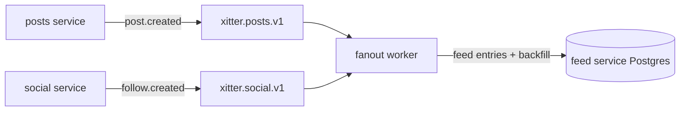

# ADR 0003: Feed fanout strategy

## Status

Decided — 2026-08-15

## Context

The product feed shows posts from followed users, most recent first. Demo scale is ~10 users, so any strategy would perform — but the point of the project is to demonstrate realistic patterns, including async workers and event-driven materialisation.

## Decision

Write-time fanout via the fanout worker:

- `posts.post.created` → the fanout worker writes one feed entry per follower, materialised in the feed service's Postgres database.
- `social.follow.created` → backfill: the fanout worker copies the followee's recent posts into the follower's feed, so a newly followed user's history appears immediately.
- Feed reads are then a simple, fast query over pre-materialised entries (followed users' posts, most-recent-first).

## Options

| Option                                                       | Pros                                                                                                                                        | Cons                                                                                                              | Verdict    |
| ------------------------------------------------------------ | ------------------------------------------------------------------------------------------------------------------------------------------- | ----------------------------------------------------------------------------------------------------------------- | ---------- |
| Read-time join (query follows + posts at request time)       | Simplest; no fanout state; always consistent                                                                                                | Doesn't demonstrate async workers/events, which is a stated project goal; feed query cost grows with follow graph | Rejected   |
| Hybrid fanout (merge celebrity accounts' posts at read time) | Scales realistically for skewed follow counts                                                                                               | Unnecessary at demo scale; extra code paths to build and test                                                     | Rejected   |
| **Write-time fanout with follow backfill (chosen)**          | Demonstrates event-driven materialisation; reads are trivial; feed service owns its data; websocket updates flow naturally from feed writes | Writes amplified by follower count; deletions/interactions must also clean up feed entries                        | **Chosen** |

## Consequences

- The fanout worker is on the critical path for feed visibility: post → Kafka → worker → feed DB. At-least-once delivery means the worker must be idempotent on `eventId` (see 0004-kafka-topic-layout.md).
- Follow backfill only copies _recent_ posts; a full historical rebuild is a reset/reseed concern, not a runtime one.
- Post deletion and unfollow/block events must remove or filter corresponding feed entries.
- Feed storage grows with (posts × followers); fine at demo scale, and the pattern is the point.
