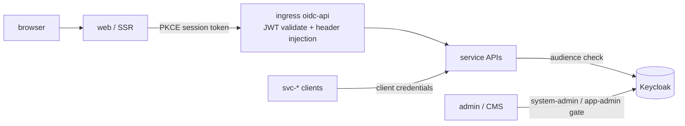

# ADR 0006: Auth model

## Status

Decided — 2026-08-15

## Context

xitter has demo accounts only (no signup), an admin/CMS surface that must be protected, and service-to-service calls that need machine identity. The deployment target is a homelab-first setup, and demo data has a nightly reset lifecycle that must not touch real homelab identities.

## Decision

**Keycloak 26** is the identity provider, with realms split by lifecycle:

- **Demo users — `xitter-demo` realm.**
  - Web client uses public OIDC authorization code flow with PKCE.
  - Demo users `demo1..demo10` with fixed passwords (`DemoPass123!`), created by `packages/scripts/src/keycloak.ts` — the single source of truth shared by local `keycloak:init` and the deployed reset job.
  - Realm settings disable self-service password reset and registration.
  - The realm is recreated on reset (nightly, and on demand), so credentials are intentionally disposable.
- **Admin — homelab `primary` realm** (locally emulated by the `xitter-local-admin` realm). Only the `system-admin` and `app-admin` roles may log in to admin/CMS, checked at login and at the edge.
- **M2M — confidential clients** `svc-social`, `svc-posts`, `svc-media`, `svc-feed`, `svc-search` using client credentials. Receiving services validate the audience.
- **Edge enforcement in-cluster**: deployed APIs are fronted by the homelab ingress module with `auth_mode=oidc-api`, which validates JWTs at the edge and injects identity headers. Internal-only endpoints additionally check service tokens.
- **Cap.js** protects the login form: site key in the web app, server-side verification in web backend routes.
- Least privilege is layered with Kubernetes RBAC and NetworkPolicies.

Local dev runs its own Keycloak docker container (port env-driven) with identical realm shapes, created by `npm run keycloak:init`.

## Options

| Option                                          | Pros                                                                                                                                                                                                         | Cons                                                                                                                              | Verdict    |
| ----------------------------------------------- | ------------------------------------------------------------------------------------------------------------------------------------------------------------------------------------------------------------ | --------------------------------------------------------------------------------------------------------------------------------- | ---------- |
| Custom JWT auth (roll our own)                  | Full control; no external dependency                                                                                                                                                                         | NIH; we'd own key rotation, flows, and every footgun; weaker than a battle-tested IdP                                             | Rejected   |
| Auth0 / other SaaS IdP                          | Polished DX                                                                                                                                                                                                  | Homelab-first constraint; external dependency for a self-contained demo; vendor coupling                                          | Rejected   |
| **Keycloak with per-lifecycle realms (chosen)** | Real OIDC flows; demo realm disposable on nightly reset while homelab identities stay untouched; M2M and edge validation out of the box; single realm-shape source shared by local and deployed environments | Another operator-hosted component; realm config must be scripted (solved by the keycloak script being the single source of truth) | **Chosen** |

## Consequences

- Realm shapes must stay scripted: any realm change goes through `packages/scripts/src/keycloak.ts`, never manual console edits (manual changes die at reset).
- The nightly reset recreates `xitter_demo` users; anything relying on stable demo identities must tolerate recreation (fixed usernames/passwords make this deterministic).
- Service APIs trust edge-injected identity headers **only** when behind the ingress; local/dev paths use forwarded bearer tokens (see 0002-frontend-data-fetching.md).
- Audience validation on `svc-*` tokens is mandatory for internal-only endpoints even though the edge already validates JWTs.
- Login form abuse is mitigated by Cap.js verification server-side in web backend routes.
