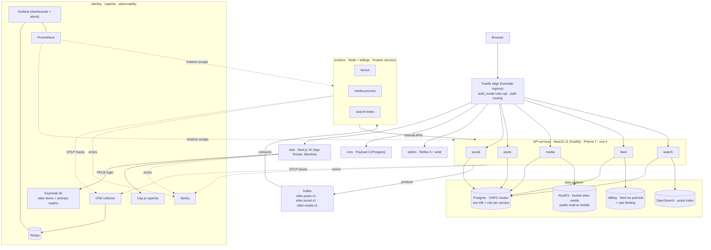

# 01 · System Overview

End-state architecture of xitter: a demo microservices platform that looks and behaves like a small production system — real ingress auth, event-driven fanout, per-service databases, full observability — while staying disposable (nightly reset, no real users, no PII).

## Goals

- **Demo** — a convincing Twitter/X-style product running on the homelab cluster, presentable to anyone at any time.
- **Learning** — a vehicle for practicing a modern TypeScript stack end to end: NestJS/Fastify, Prisma, Next.js App Router, Kafka, OpenSearch, OTel, Kubernetes/Knative, Tofu.
- **Showcase** — production-shaped engineering defaults: versioned zod-validated APIs, event-driven choreography, observability and alerting as part of development work, reproducible environments with deterministic reseed.

## Non-goals

- Scale beyond a single cluster: no multi-region, sharding, or sustained-load tuning beyond the stated SLOs.
- Real users or real data: no account model beyond the demo realm, no PII, no compliance posture.
- Native mobile apps: responsive web only.
- Moderation beyond blocks, monetisation, or any SLA/uptime commitment.

## Component model

## Edge routing

The edge performs no path rewriting for APIs: each service owns its **full path prefix** (including `/api/{service}`), so routing is byte-identical locally and in-cluster.

| Path          | Target         | Notes                                                                      |
| ------------- | -------------- | -------------------------------------------------------------------------- |
| `/`           | web            | Next.js App Router; nothing visible unauthenticated                        |
| `/api/social` | social service | Profiles, follows, blocks                                                  |
| `/api/posts`  | posts service  | Posts, replies, interactions, bookmarks                                    |
| `/api/media`  | media service  | JSON metadata + presigned upload URLs; binaries are PUT directly to RustFS |
| `/api/feed`   | feed service   | Materialised home timeline + WebSocket (`/api/feed/v1/ws`)                 |
| `/api/search` | search service | Post full-text search                                                      |
| `/media`      | RustFS         | Public read; `/media/` prefix stripped to bucket root (`xitter-media`)     |
| `/cms`        | cms            | Payload admin UI; primary realm, `app-admin` role                          |
| `/admin`      | admin          | Refine console; primary realm, `system-admin` role                         |

In-cluster, the edge validates Keycloak access tokens (`auth_mode=oidc-api`) and injects identity headers (`X-User-Id`, …); see [07-security.md](07-security.md).

**Geo posture (T14):** all `xitter-dev` host routes and exactly three paths on `idp.jd-chapman.dev` — `realms/xitter-demo` (realm endpoints), `resources` and `js` (login theme assets) — disable the homelab edge geoblock, so the demo is reachable globally; cloudflare + crowdsec middlewares stay on. Everything else on the idp host (`realms/primary`, Keycloak `/admin`) remains UK-only via the homelab's host-level route (xitter's path routes win on explicit priority 200). Login defence for the now-globally-reachable demo realm is Keycloak brute-force protection (temporary lockout), not geo.

| idp host path            | Target              | Notes                                                            |
| ------------------------ | ------------------- | ---------------------------------------------------------------- |
| `/realms/xitter-demo`    | keycloak (existing) | Demo realm endpoints; geo-open, priority 200, xitter Tofu-owned  |
| `/resources`, `/js`      | keycloak (existing) | Realm-agnostic login theme assets; geo-open, priority 200        |

## Environment model

Namespace-per-environment, deployed via Tofu environments using the homelab ingress module; all supporting infrastructure (CNPG, Kafka, OpenSearch, RustFS, Valkey, Keycloak, observability stack) is declared as CRs/providers, not hand-configured.

|            | dev                                                                                    | prod                               |
| ---------- | -------------------------------------------------------------------------------------- | ---------------------------------- |
| Namespace  | `xitter-dev`                                                                           | `xitter-prod`                      |
| Domain     | `xitter-dev.jd-chapman.dev`                                                            | `xitter.jd-chapman.dev`            |
| Deployment | merges to `dev` branch                                                                 | gitflow `dev` → `release` → `prod` |
| Versioning | GHCR image per app/service on every merge: immutable `sha-<short>` + mutable `dev` tag | same, promoted via release tag     |
| Reset      | nightly                                                                                | nightly                            |

Both environments are demo environments: data is ephemeral, Velero backup excludes both namespaces, and the nightly reset (00:00 UTC, configurable) wipes and optionally reseeds state — see [05-data-platform.md](05-data-platform.md) and the [operations specs](../operations/).

## Local parity

Local development mirrors the cluster: dependencies run in Docker under project `xitter-${XITTER_ENV}`, a local Traefik edge applies the same path routing as the cluster ingress, and apps run on the host via turbo. `XITTER_PORT_OFFSET` shifts every port so multiple stacks can run in parallel.

| Component | Base port |     | Component  | Base port |
| --------- | --------- | --- | ---------- | --------- |
| edge      | 8080      |     | postgres   | 5532      |
| web       | 3456      |     | kafka      | 9092      |
| cms       | 3457      |     | opensearch | 9200      |
| admin     | 3458      |     | rustfs     | 9000      |
| social    | 8101      |     | valkey     | 6379      |
| posts     | 8102      |     | keycloak   | 8090      |
| media     | 8103      |     |            |           |
| feed      | 8104      |     |            |           |
| search    | 8105      |     |            |           |

Local auth differs from the cluster in one deliberate way: without the edge's oidc-api validation, services validate bearer tokens directly against Keycloak — see the decision in [07-security.md](07-security.md).
