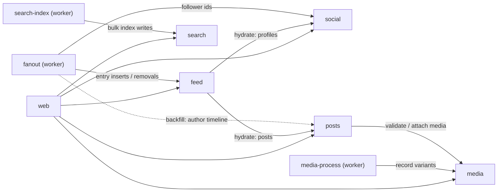

# 02 · Service Catalog

Who does what, who owns what, and who calls whom. The full endpoint contract lives in [03-service-interfaces.md](03-service-interfaces.md); event payloads in [04-event-driven-flows.md](04-event-driven-flows.md); store layouts in [05-data-platform.md](05-data-platform.md).

**Ownership rule:** a service's data is only ever accessed through its API (or its events). No shared databases, no cross-service reads.

## Frontends

| App   | Stack                                                                           | One-liner                                                                                                                                                                                                                  |
| ----- | ------------------------------------------------------------------------------- | -------------------------------------------------------------------------------------------------------------------------------------------------------------------------------------------------------------------------- |
| web   | Next.js ^16.3 App Router, React ^19.2, Mantine ^9.5, @tabler/icons-react, dayjs | The product: auth-gated feed, posting, profiles, search; formats feed timestamps per product rule (relative <24h rounded to most significant figure, absolute `D MMM YYYY HH:mm` after — see [product specs](../product/)) |
| cms   | Payload ^3.88 (Postgres adapter)                                                | Content/back-office data entry at `/cms`; primary realm, `app-admin` gated                                                                                                                                                 |
| admin | Refine ^5 + antd ^6 + react-router ^7                                           | Operational console over service APIs at `/admin`; primary realm, `system-admin` gated                                                                                                                                     |

## Services

### social

|                |                                                                                                                       |
| -------------- | --------------------------------------------------------------------------------------------------------------------- |
| Responsibility | User profiles, follow graph, block graph, relationship state                                                          |
| Owns           | `social` Postgres DB (profiles, follows, blocks)                                                                      |
| Public API     | Profile create/read/patch, username lookup, follow/unfollow, block/unblock, relationship, following/followers cursors |
| Internal API   | Follower id lists for fanout; reseed                                                                                  |
| Emits          | `social.follow.created`, `social.follow.deleted`, `social.block.created`, `social.block.deleted` → `xitter.social.v1` |
| Consumes       | — (does not consume events)                                                                                           |
| Scaling        | Stateless; read-heavy graph lookups served from indexed tables; blocks enforced at write time here                    |

### posts

|                |                                                                                                                          |
| -------------- | ------------------------------------------------------------------------------------------------------------------------ |
| Responsibility | Posts (text + optional media refs), replies, interactions (like/bookmark/repost), bookmarks                              |
| Owns           | `posts` Postgres DB                                                                                                      |
| Public API     | Post create/read/delete, author timelines, replies, interactions, bookmarks                                              |
| Internal API   | Reseed                                                                                                                   |
| Emits          | `posts.post.created`, `posts.post.deleted`, `posts.interaction.created`, `posts.interaction.deleted` → `xitter.posts.v1` |
| Consumes       | —                                                                                                                        |
| Calls          | media — validates/attaches media refs at post creation                                                                   |
| Scaling        | Stateless; hottest write path; interaction counts kept denormalised in the posts DB                                      |

### media

|                |                                                                                                      |
| -------------- | ---------------------------------------------------------------------------------------------------- |
| Responsibility | Upload orchestration: issues presigned PUTs to RustFS, tracks upload state and processed variants    |
| Owns           | `media` Postgres DB (media metadata) + RustFS bucket `xitter-media`                                  |
| Public API     | Create upload (presigned URL), fetch media metadata incl. variant URLs                               |
| Internal API   | Record processed variants; reseed                                                                    |
| Emits          | `media.media.uploaded`, `media.media.processed` → `xitter.media.v1`                                  |
| Consumes       | —                                                                                                    |
| Scaling        | Stateless; binaries never pass through the service (browser → RustFS direct, worker → RustFS direct) |

### feed

|                  |                                                                                                                           |
| ---------------- | ------------------------------------------------------------------------------------------------------------------------- |
| Responsibility   | Materialised home timelines: followed authors' posts + own posts, most recent first; realtime "new items" notifications   |
| Owns             | `feed` Postgres DB (feed entries) + Valkey channels `feed:updates:{userId}`                                               |
| Public API       | `GET /feed` (cursor), WebSocket `/ws`                                                                                     |
| Internal API     | Bulk fanout entry inserts; per-user feed delete (reset); reseed                                                           |
| Emits / Consumes | Neither — feed is written by the fanout worker via internal API; entries inserted trigger Valkey publish → WebSocket push |
| Calls            | social + posts — server-side joins to hydrate entries into full feed items at read time                                   |
| Scaling          | Stateless API; entry writes are bulk inserts; WebSocket fanout scales via Valkey pub/sub across feed replicas             |

### search

|                  |                                                                                     |
| ---------------- | ----------------------------------------------------------------------------------- |
| Responsibility   | Full-text search over posts                                                         |
| Owns             | `search` Postgres DB (minimal service state) + OpenSearch `posts` index             |
| Public API       | `GET /search/posts?q=`                                                              |
| Internal API     | Bulk index upsert/delete; reseed                                                    |
| Emits / Consumes | Neither — index writes arrive via the search-index worker through the internal API  |
| Scaling          | Stateless; OpenSearch does the work; index recreated wholesale by the nightly reset |

## Workers

Plain Node + kafkajs, deployed as Knative services. All writes go back through service internal APIs — workers own no data stores.

### fanout

|                |                                                                                                                                                                                                  |
| -------------- | ------------------------------------------------------------------------------------------------------------------------------------------------------------------------------------------------ |
| Responsibility | Feed materialisation: on new post → insert entries for author + followers; on follow → bounded backfill of the followed author's recent posts; on unfollow/post delete → remove matching entries |
| Consumes       | `xitter.posts.v1`, `xitter.social.v1`                                                                                                                                                            |
| Calls          | social (follower ids), feed (entry inserts/removals), posts (author timeline for backfill)                                                                                                       |
| Scaling        | Scales on consumer lag; per-key (postId / userId) partition ordering keeps fanout deterministic                                                                                                  |

### media-process

| | |
|---| --- | --- |
| Responsibility | Variant generation: fetch original from RustFS, produce `thumb`, write back, record variants |
| Consumes | `xitter.media.v1` (`media.media.uploaded`) |
| Calls | media (record variants via internal API) |
| Scaling | CPU-bound image work; scales on lag; idempotent per mediaId |

### search-index

| | |
|---| --- | --- |
| Responsibility | Keeps OpenSearch in sync: batch upserts/deletes post documents |
| Consumes | `xitter.posts.v1` (`posts.post.created`, `posts.post.deleted`) |
| Calls | search (bulk index APIs) |
| Scaling | Batches events; scales on lag; upserts keyed by postId |

## Dependency graph

Not shown: cms/admin call the same public (and, where licensed, internal) service APIs as web; every service and worker produces traces/metrics/logs — see [06-observability.md](06-observability.md).
