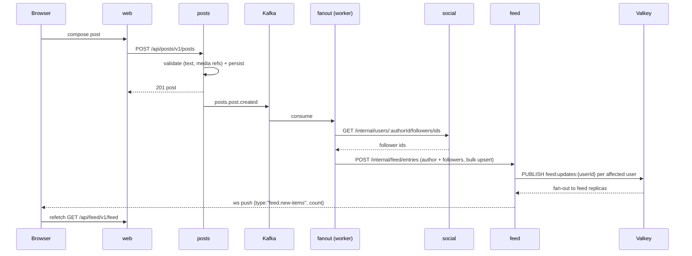
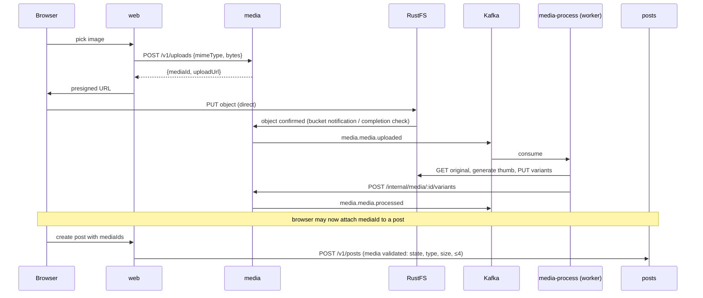
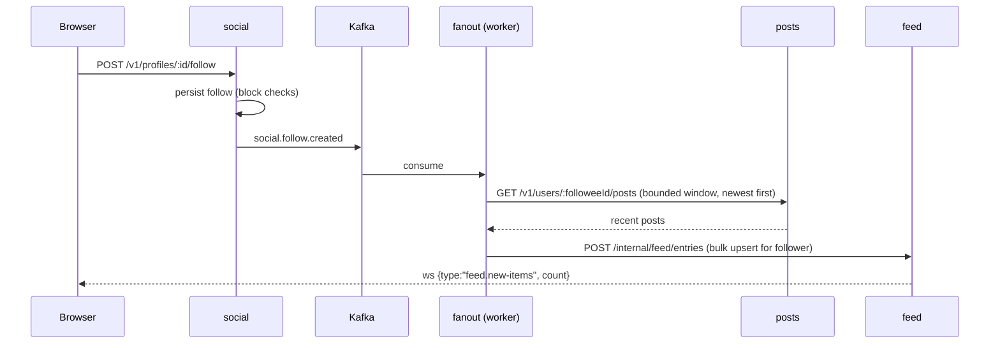
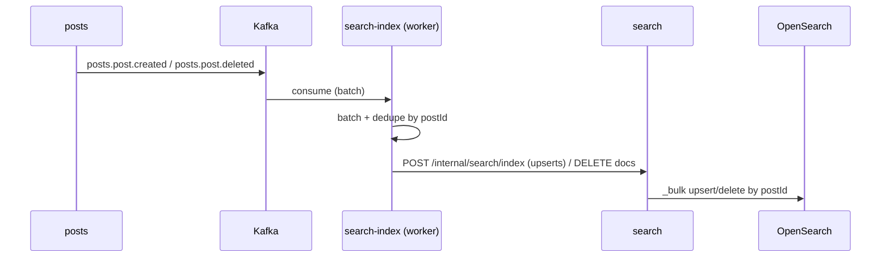

# 04 · Event-Driven Flows

Kafka is the only asynchronous integration mechanism between services and workers: producers emit domain events, workers consume them and call back through internal APIs. No service calls another service's write path synchronously.

## Topics

| Topic              | Producer | Partitions | Retention | Partition key                                          |
| ------------------ | -------- | ---------- | --------- | ------------------------------------------------------ |
| `xitter.posts.v1`  | posts    | 6          | 7d        | `postId` (interaction events: `postId`)                |
| `xitter.social.v1` | social   | 6          | 7d        | acting user (`followerId` / `blockerId` / `profileId`) |
| `xitter.media.v1`  | media    | 6          | 7d        | `mediaId`                                              |

Partition keys preserve per-aggregate ordering (a post's lifecycle, a user's graph changes, a media object's processing) — consumers must not assume cross-partition ordering.

## Envelope

Every message is JSON with a single envelope; consumers validate it at the boundary. Delivery is **at-least-once**; consumers must be idempotent (rules below).

| Field          | Type         | Rule                                                     |
| -------------- | ------------ | -------------------------------------------------------- |
| `eventId`      | uuid v4      | Unique per event; the idempotency key                    |
| `eventType`    | string       | Dotted name from the catalogue below                     |
| `eventVersion` | int          | Payload schema version, starts at `1`                    |
| `producer`     | string       | Emitting service name (e.g. `posts`)                     |
| `occurredAt`   | ISO-8601 UTC | Domain time of occurrence                                |
| `payload`      | object       | Per-eventType schema (zod, in the shared events package) |

```json
{
  "eventId": "8f14e45f-ceea-4b1f-9a3d-1d64f6cd7a11",
  "eventType": "posts.post.created",
  "eventVersion": 1,
  "producer": "posts",
  "occurredAt": "2026-08-15T09:30:00.123Z",
  "payload": {
    "postId": "c2d1e000-0000-4000-8000-000000000001",
    "authorId": "demo3",
    "text": "hello xitter",
    "mediaIds": [],
    "replyToId": null,
    "createdAt": "2026-08-15T09:30:00.123Z"
  }
}
```

## Event catalogue

| eventType                   | Topic              | Payload fields                                                        | Emitted when                                               |
| --------------------------- | ------------------ | --------------------------------------------------------------------- | ---------------------------------------------------------- |
| `posts.post.created`        | `xitter.posts.v1`  | `postId`, `authorId`, `text`, `mediaIds[]`, `replyToId?`, `repostOfId?`, `createdAt` | Post created (top-level or reply)                          |
| `posts.post.deleted`        | `xitter.posts.v1`  | `postId`, `authorId`, `deletedAt`                                     | Post deleted by author                                     |
| `posts.interaction.created` | `xitter.posts.v1`  | `interactionId`, `postId`, `userId`, `kind`, `createdAt`              | like/bookmark/repost added                                 |
| `posts.interaction.deleted` | `xitter.posts.v1`  | `postId`, `userId`, `kind`, `deletedAt`                               | Interaction removed                                        |
| `social.follow.created`     | `xitter.social.v1` | `followerId`, `followeeId`, `createdAt`                               | Follow established                                         |
| `social.follow.deleted`     | `xitter.social.v1` | `followerId`, `followeeId`, `deletedAt`                               | Unfollowed                                                 |
| `social.block.created`      | `xitter.social.v1` | `blockerId`, `blockedId`, `createdAt`                                 | Block established                                          |
| `social.block.deleted`      | `xitter.social.v1` | `blockerId`, `blockedId`, `deletedAt`                                 | Block removed                                              |
| `social.profile.updated`    | `xitter.social.v1` | `profileId`, `username`, `displayName`, `bio`, `updatedAt`            | Own profile created (login bootstrap) or edited (name/bio) |
| `media.media.uploaded`      | `xitter.media.v1`  | `mediaId`, `userId`, `mimeType`, `bytes`, `createdAt`                 | Upload slot fulfilled — object confirmed present in RustFS |
| `media.media.processed`     | `xitter.media.v1`  | `mediaId`, `variants[] {kind, key}`, `processedAt`                    | Variants (`original`, `thumb`) written and recorded        |

## Flows

### Post creation → fanout → feed materialisation + WebSocket notify



### Media upload → processing → post referencing media



### Follow → timeline backfill



Unfollow (`social.follow.deleted`) removes the followee's entries from the follower's feed via the feed internal API. **Blocks are different — explicit product decision:** `social.block.*` prevents _future_ interactions (likes, reposts, replies, follows on the blocker's content, enforced at write time); **historical feed entries are not rewritten and remain until the nightly reset.** Block events therefore have no feed consumer.

### Search indexing



## Consumer groups

| Group           | Worker        | Topics                                | Notes                                                              |
| --------------- | ------------- | ------------------------------------- | ------------------------------------------------------------------ |
| `fanout`        | fanout        | `xitter.posts.v1`, `xitter.social.v1` | Feed materialisation + backfill/removal                            |
| `media-process` | media-process | `xitter.media.v1`                     | Only `media.media.uploaded` is actionable                          |
| `search-index`  | search-index  | `xitter.posts.v1`                     | Only `posts.post.*` are actionable; batches for `_bulk` efficiency |

Groups (and topic data) are deleted and recreated by the nightly reset — see [05-data-platform.md](05-data-platform.md).

## Idempotency rules

At-least-once delivery means every flow below must tolerate redelivery:

1. **eventId dedupe** — each worker persists processed `eventId`s (store with retention ≥ topic retention, 7d) and skips already-seen events before doing side-effectful work.
2. **Natural-key upserts** — all writes are idempotent on business keys, so a replay after a crash converges:
   - feed entries: unique `(userId, postId)` — insert on conflict do nothing
   - search documents: upsert keyed by `postId`; deletes are tombstones (`deletedAt`)
   - media variants: variant writes keyed by `(mediaId, kind)` — regeneration overwrites
3. **No read-modify-write races** — counters and variant state use atomic upserts; consumers never rely on event ordering across partitions.
