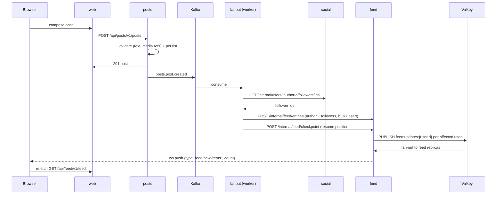
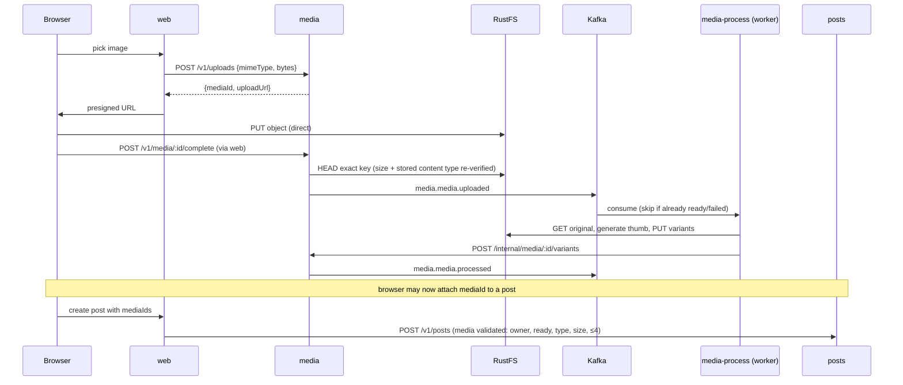
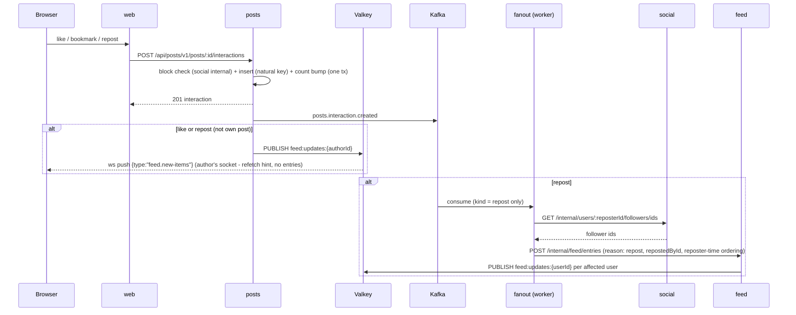
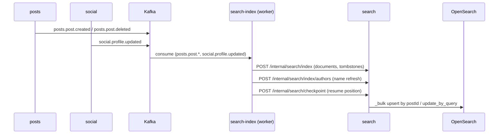

# 04 · Event-Driven Flows

Kafka is the only asynchronous integration mechanism between services and workers: producers emit domain events, workers consume them and call back through internal APIs. No service calls another service's write path synchronously.

## Topics

| Topic              | Producer | Partitions | Retention | Partition key                                          |
| ------------------ | -------- | ---------- | --------- | ------------------------------------------------------ |
| `xitter.posts.v1`  | posts    | 6          | 7d        | `postId` (interaction events: `postId`)                |
| `xitter.social.v1` | social   | 6          | 7d        | acting user (`followerId` / `blockerId` / `profileId`) |
| `xitter.media.v1`  | media    | 6          | 7d        | `mediaId`                                              |

Partition keys preserve per-aggregate ordering (a post's lifecycle, a user's graph changes, a media object's processing) — consumers must not assume cross-partition ordering. Producers thread the aggregate id (`postId`, acting user, `mediaId`) through `EventProducer.emit` as the Kafka message key; events emitted without a key fall back to the event type, which orders only per event type.

## Envelope

Every message is JSON with a single envelope; consumers validate it at the boundary. Delivery is **at-least-once**; consumers must be idempotent (rules below).

| Field          | Type         | Rule                                                     |
| -------------- | ------------ | -------------------------------------------------------- |
| `eventId`      | uuid v4      | Unique per event; the idempotency key                    |
| `eventType`    | string       | Dotted name from the catalogue below                     |
| `eventVersion` | int          | Payload schema version, starts at `1`                    |
| `producer`     | string       | Emitting service name (e.g. `posts`)                     |
| `occurredAt`   | ISO-8601 UTC | Domain time of occurrence                                |
| `payload`      | object       | Per-eventType schema (zod, in the shared events package) |

```json
{
  "eventId": "8f14e45f-ceea-4b1f-9a3d-1d64f6cd7a11",
  "eventType": "posts.post.created",
  "eventVersion": 1,
  "producer": "posts",
  "occurredAt": "2026-08-15T09:30:00.123Z",
  "payload": {
    "postId": "c2d1e000-0000-4000-8000-000000000001",
    "authorId": "demo3",
    "text": "hello xitter",
    "mediaIds": [],
    "replyToId": null,
    "createdAt": "2026-08-15T09:30:00.123Z"
  }
}
```

## Client library

All Kafka clients come from `@xitter/events` (`createEventProducer`, `createEventConsumer`, `runEventWorker` — never `new Kafka()` directly). The package also carries a runtime guard (`kafka-request-queue-fix.ts`) for a kafkajs defect (2.2.4 through master, 2026-08): the per-connection request queue arms its pending-request re-check timer at `throttledUntil(-1) - Date.now()` whenever a response completes on an idle queue — the epoch-sized negative `TimeoutNegativeWarning` in every service's boot log, self-re-arming as a ~1ms timer per broker connection for the process lifetime. The guard skips arming when nothing is pending; `kafka-request-queue-fix.test.ts` pins it against the real kafkajs class, so an upstream change fails the test rather than silently regressing. Drop the guard when a fixed kafkajs ships.

## Event catalogue

| eventType                   | Topic              | Payload fields                                                                                      | Emitted when                                                                         |
| --------------------------- | ------------------ | --------------------------------------------------------------------------------------------------- | ------------------------------------------------------------------------------------ |
| `posts.post.created`        | `xitter.posts.v1`  | `postId`, `authorId`, `text`, `mediaIds[]`, `replyToId?`, `repostOfId?`, `createdAt`                | Post created (top-level or reply)                                                    |
| `posts.post.deleted`        | `xitter.posts.v1`  | `postId`, `authorId`, `deletedAt`                                                                   | Post deleted by author                                                               |
| `posts.interaction.created` | `xitter.posts.v1`  | `interactionId`, `postId`, `userId`, `kind`, `createdAt`                                            | like/bookmark/repost added                                                           |
| `posts.interaction.deleted` | `xitter.posts.v1`  | `postId`, `userId`, `kind`, `deletedAt`                                                             | Interaction removed                                                                  |     | `social.follow.created` | `xitter.social.v1` | `followerId`, `followeeId`, `createdAt` | Follow established |
| `social.follow.deleted`     | `xitter.social.v1` | `followerId`, `followeeId`, `deletedAt`                                                             | Unfollowed                                                                           |
| `social.block.created`      | `xitter.social.v1` | `blockerId`, `blockedId`, `createdAt`                                                               | Block established                                                                    |
| `social.block.deleted`      | `xitter.social.v1` | `blockerId`, `blockedId`, `deletedAt`                                                               | Block removed                                                                        |
| `social.profile.updated`    | `xitter.social.v1` | `profileId`, `username`, `displayName`, `bio`, `updatedAt`                                          | Own profile created (login bootstrap) or edited (name/bio)                           |
| `media.media.uploaded`      | `xitter.media.v1`  | `mediaId`, `ownerId`, `objectKey`, `mimeType`, `bytes`, `createdAt`                                 | Completion verified the object (HEAD) — key, size and stored content type re-checked |
| `media.media.processed`     | `xitter.media.v1`  | `mediaId`, `ownerId`, `variants[] {kind, objectKey, mimeType, bytes, width, height}`, `processedAt` | Variants (`original`, `thumb`) written and recorded                                  |

## Flows

### Post creation → fanout → feed materialisation + WebSocket notify



Design notes:

- **Event emission is best-effort but loud.** A Kafka outage never fails the user's mutation (the DB write committed; at-least-once consumers are idempotent), but the posts service logs a structured error carrying the post id (`emitSafe`), so a downstream view missing an item is traceable from the posts logs alone.
- **Downtime is not data loss (#149).** The fanout worker checkpoints every consumed position to the feed service (`FeedCheckpoint`) after the event's side effects succeed, and fetches those positions (with patience — the feed service may still be booting) before joining the group. A restart outside a reset therefore resumes exactly after the last processed event instead of the reset gate's fresh-boot seek-to-end, which would permanently skip the events produced while the worker was down. Feed owns the store because fanout materialises feed's data; the nightly reseed wipes it together with the entries (a fresh feed must not resume into a log that predates the wipe), at which point the gate's fail-safe (seek to log end) governs again. Replays are safe: entry writes are idempotent on `(userId, entryKey)`.

### Media upload → processing → post referencing media



### Follow → timeline backfill


Unfollow (`social.follow.deleted`) removes the followee's entries from the follower's feed via the feed internal API (`DELETE /internal/feed/users/:followerId/authors/:followeeId`). Follow backfill copies the followee's **20 most recent posts** (`POST /api/posts/internal/posts/by-author` — workers hold service tokens, the public timeline requires a user token; bounded window; a full historical rebuild is a reset concern, not a runtime one). **Blocks are different — explicit product decision:** `social.block.*` prevents _future_ interactions (likes, reposts, replies, follows on the blocker's content, enforced at write time); **historical feed entries are not rewritten and remain until the nightly reset.** Block events therefore have no feed consumer; blocked authors are filtered at feed read time instead.

### Interactions → counts, author ping, repost fanout



Design notes:

- **Author ping is synchronous, fanout is not.** The ping publishes from the posts service straight to Valkey on the interaction's commit path (a like should light up for the author within the request, not behind consumer lag); the repost's _feed entries_ go through Kafka like every other materialisation. The channel name lives in `@xitter/api-contracts` (`feedUpdatesChannel`) so the two publishers cannot drift.
- **Bookmarks never ping** — the author must not learn who bookmarked (product 6.2 privacy); the fanout worker also ignores `kind: bookmark|like` entirely.
- **Repost entries are attributed to the reposter**: `authorId`/`repostedById` = reposter, `postCreatedAt` = repost time (a repost arrives as a fresh feed item), `postId` = the original post. Reposts fan out to the **reposter's** followers, not the original author's audience. Reposting a repost is impossible by construction — reposts are interactions on posts, not posts, so no chain can form. The stored `authorId` is the feed-surface author (unfollow/block filtering stays query-level); hydration renders the ORIGINAL author as `author` with the reposter on `repostedBy` (#145) — the card identity is always the post's true author.
- **Undo** (`posts.interaction.deleted`, kind=repost) removes exactly that reposter's entries (`DELETE /internal/feed/posts/:postId/reposts/:repostedById`); the post's own entries and other reposters' survive. Undo of any kind is never block-checked — it removes the caller's own footprint.

### Search indexing



Documents are keyed by `postId` (idempotent replays converge); deletes are tombstones (`deletedAt` set) that queries exclude. The worker consumes in fetch batches (eachBatch): per batch it resolves every author's display name with one bulk profile lookup, upserts all documents in one bulk request, refreshes any renamed authors, and only then checkpoints the batch's last offset to the search service (persisted in `SearchCheckpoint`) — the checkpoint is written strictly **after** the index writes succeed, and Kafka offsets commit only per resolved batch, so a failed batch redelivers whole and a lost consumer group resumes exactly after the last flushed batch. Kafka group offsets die with the nightly reset's group deletion, the checkpoints survive in the search DB. A fresh group (no checkpoints) replays the whole log from the beginning and the index rebuilds. The search service ensures the index exists once at boot (re-ensuring on `index_not_found` if a write races the reset's index deletion), not per write. Author display names are resolved from social at index time (bulk profile lookup; placeholder on outage) and kept fresh in place by `social.profile.updated`.

## Consumer groups

Group ids live in `CONSUMER_GROUPS` (`packages/events/src/topics.ts`); the nightly reset recreates them (see [05-data-platform.md](05-data-platform.md)).

| Group                         | Worker        | Topics                                | Notes                                                                                                                                                                                 |
| ----------------------------- | ------------- | ------------------------------------- | ------------------------------------------------------------------------------------------------------------------------------------------------------------------------------------- |
| `xitter-fanout-worker`        | fanout        | `xitter.posts.v1`, `xitter.social.v1` | Feed materialisation + backfill/removal; checkpoints every consumed position to feed (`FeedCheckpoint`) so a restart outside a reset resumes instead of seeking to the log end (#149) |
| `xitter-media-process-worker` | media-process | `xitter.media.v1`                     | Only `media.media.uploaded` is actionable                                                                                                                                             |
| `xitter-search-index-worker`  | search-index  | `xitter.posts.v1`, `xitter.social.v1` | `posts.post.*` index/tombstone documents; `social.profile.updated` refreshes denormalised author names; batches events per fetch (one bulk upsert + one checkpoint per batch)         |

Groups (and topic data) are deleted and recreated by the nightly reset — see [05-data-platform.md](05-data-platform.md).

## Idempotency rules

At-least-once delivery means every flow below must tolerate redelivery:

1. **eventId dedupe** — each worker persists processed `eventId`s (store with retention ≥ topic retention, 7d) and skips already-seen events before doing side-effectful work.
2. **Natural-key upserts** — all writes are idempotent on business keys, so a replay after a crash converges:
   - feed entries: unique `(userId, entryKey)` where `entryKey` is the derived source identity (`post:{postId}` or `repost:{postId}:{repostedById}`) — insert on conflict do nothing. `repostedById` itself cannot join a unique index because it is NULL for `reason = 'post'` rows and Postgres treats NULLs as distinct; the derived key is computed by `feedEntryKey` in `@xitter/api-contracts` so the fanout worker and the feed service cannot disagree on the format
   - search documents: upsert keyed by `postId`; deletes are tombstones (`deletedAt`)
   - media variants: variant writes keyed by `(mediaId, kind)` — regeneration overwrites
3. **No read-modify-write races** — counters and variant state use atomic upserts; consumers never rely on event ordering across partitions. Interaction counts move in the same DB transaction as the interaction row (posts service), so concurrent duplicate likes land exactly one increment.
