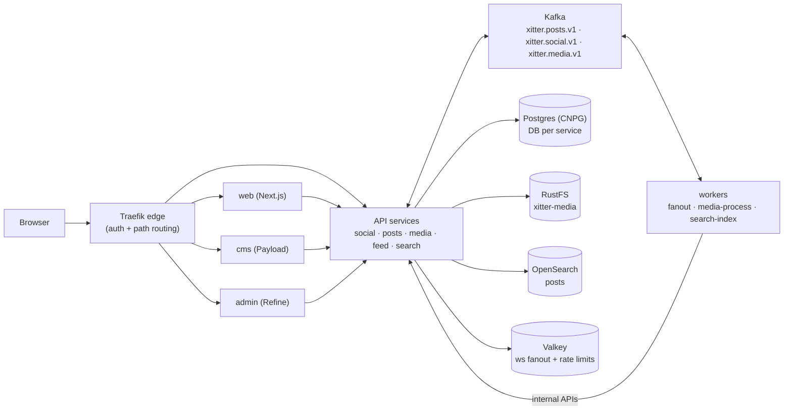

# Architecture Specs

These specs describe the **desired end-state** of the xitter platform: a Twitter/X-style demo built as a TypeScript microservices monorepo (Next.js web, Payload CMS, Refine admin, five NestJS API services, three Kafka-driven workers), deployed to a homelab Kubernetes cluster behind a Traefik edge, with per-service Postgres databases, RustFS object storage, OpenSearch, and Valkey. Every spec here is self-contained; sibling specs are referenced by relative path.

| Spec                                                 | Covers                                                                                   |
| ---------------------------------------------------- | ---------------------------------------------------------------------------------------- |
| [01-system-overview.md](01-system-overview.md)       | Goals and non-goals, component model, edge routing, environment model, local parity      |
| [02-service-catalog.md](02-service-catalog.md)       | Per-app/service/worker responsibility, data ownership, API summaries, dependency graph   |
| [03-service-interfaces.md](03-service-interfaces.md) | The API contract: conventions, endpoint tables, WebSocket contract, internal APIs        |
| [04-event-driven-flows.md](04-event-driven-flows.md) | Kafka topics, event envelope and catalogue, sequence flows, consumer groups, idempotency |
| [05-data-platform.md](05-data-platform.md)           | Store ownership, Postgres/RustFS/OpenSearch/Valkey layout, retention and reset semantics |
| [06-observability.md](06-observability.md)           | Traces, metrics, logs, Sentry, required dashboards and alerts                            |
| [07-security.md](07-security.md)                     | Authentication/authorisation model, network segmentation, RBAC, secrets, rate limiting   |
| `openapi/`                                           | Generated per-service OpenAPI artifacts (`npm run openapi:gen`)                          |

Sibling spec folders: [product](../product/), [data](../data/), [operations](../operations/), [testing](../testing/).

## System at a glance

The browser talks to a single Traefik edge that routes `/` to the web app, `/api/{service}` to the API services, `/media` to object storage, and `/cms`/`/admin` to the back-office apps. Services own their data in isolated stores and communicate asynchronously through Kafka; workers consume events and drive fanout, media processing, and search indexing back through internal service APIs.

Cross-cutting platform concerns — Keycloak 26 identity (demo + primary realms), Cap.js captcha, OTel traces to Tempo, Prometheus metrics, Grafana dashboards and alerting, Sentry error tracking — are provisioned declaratively via Tofu; see [06-observability.md](06-observability.md) and [07-security.md](07-security.md).
