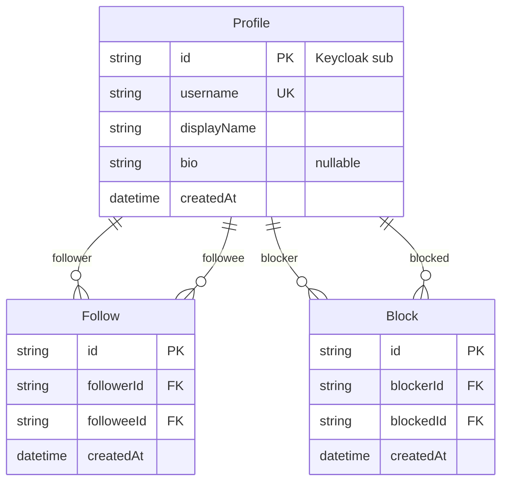
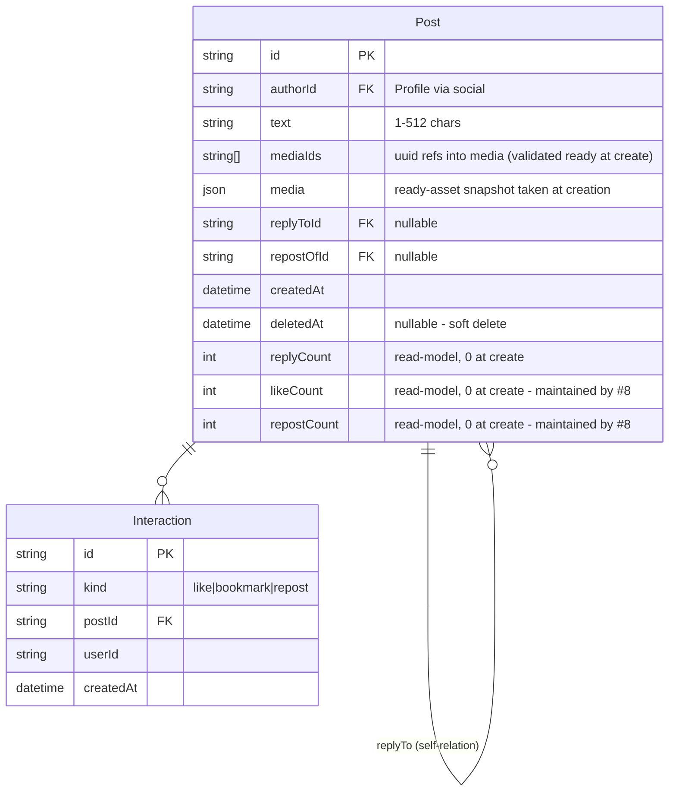
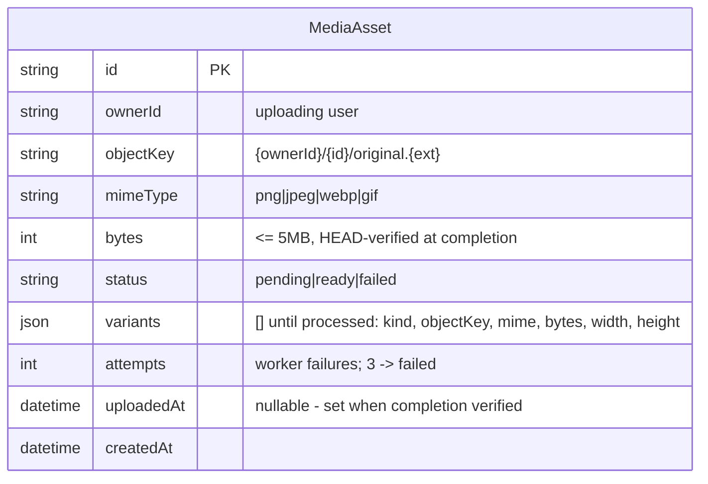
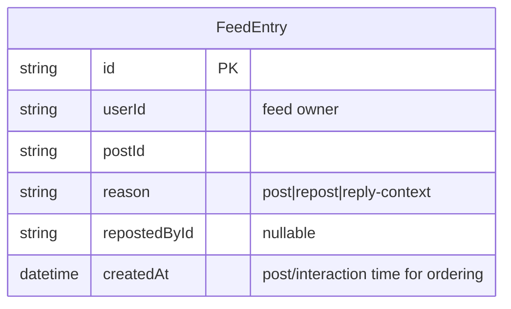
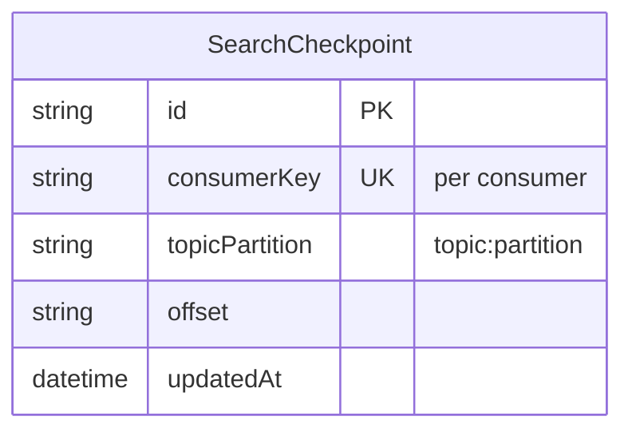

# Storage Model

Per-service data ownership. Each service owns exactly one store and is the only reader/writer of it — no cross-service database access, ever. Cross-service consistency happens via events (see [03-data-lifecycle.md](./03-data-lifecycle.md)).

## Ownership matrix

| Domain                    | Owning service | Store                                             | Notes                                                                                 |
| ------------------------- | -------------- | ------------------------------------------------- | ------------------------------------------------------------------------------------- |
| Profiles, follows, blocks | social         | Postgres (`social`)                               | Identity-adjacent data; user info itself lives in Keycloak                            |
| Posts, interactions       | posts          | Postgres (`posts`)                                | Source of truth for posts, replies, likes, bookmarks, reposts                         |
| Media assets              | media          | Postgres (`media`) + RustFS bucket `xitter-media` | Objects keyed `{userId}/{mediaId}/{original\|thumb}.{ext}`                            |
| Feed entries              | feed           | Postgres (`feed`)                                 | Materialised per-user timeline, event-fed                                             |
| Search                    | search         | Postgres (`search`) + OpenSearch `posts` index    | Postgres holds only checkpoints; OpenSearch holds the index                           |
| Site content              | cms (Payload)  | Postgres (`cms`)                                  | Payload-managed tables: landing intro, FAQ entries, users/sessions for the CMS itself |

Shared, non-service-owned stores: Kafka (event bus), Valkey (ephemeral: ws pub/sub, rate limits — never a source of truth), Keycloak (identity).

## Per-service ER

### social

Uniques: `Follow(followerId, followeeId)`, `Block(blockerId, blockedId)`. The profile row is keyed by the Keycloak `sub` itself (no separate user id); `username` is unique and mirrors the Keycloak `preferred_username`.

### posts

Unique: `Interaction(kind, postId, userId)` — one of each kind per user per post. Replies are posts (self-relation); the counts read-model lives on the post row — replies maintain `replyCount` transactionally in the posts service, likes/reposts are maintained by #8's interaction flows. Deleting is soft (`deletedAt` set); deleted posts are excluded from every read path (timelines, threads, lookups) but rows persist for interaction accounting.

### media

Assets are never foreign-keyed to posts: attachment is validated at post creation (existence, ownership, `ready`) via the media internal API, and the post row stores a snapshot of the ready asset's variants so reads render without a media round-trip. Variants are immutable once recorded, so the snapshot cannot drift.

### feed

Unique: `FeedEntry(userId, postId, reason, repostedById)` — idempotent event application.

### search

The OpenSearch `posts` index is derived data, fully rebuildable from `posts` events.

### cms

Payload-managed tables (schema owned by Payload collections/migrations): landing intro content, FAQ entries (question, answer, order), and Payload's own admin users/sessions. No product services read this DB directly; the web app reads via the CMS API.

## Field-level tables

Field tables above (types/constraints inline in each ER diagram) are normative. Additional constraints:

- All ids are string (ULID/UUID) primary keys.
- All `createdAt` are set by the owning service; no client-supplied timestamps.
- `Post.text` is 1–512 chars, enforced at the API boundary and in the schema.
- `Post.mediaIds` reference media assets by uuid; at post creation each must exist, belong to the author and be `ready` (checked via the media internal lookup — see [../architecture/03-service-interfaces.md](../architecture/03-service-interfaces.md)). The row also stores a `media` JSON snapshot of the resolved assets.
- `MediaAsset.bytes` ≤ 5 MB: claimed at slot creation and re-verified against the object's real size (plus stored content type) when completion HEADs the key — client claims are never trusted.

## Index strategy

| Store      | Indexes (beyond PKs/uniques)                                                     | Serves                                                    |
| ---------- | -------------------------------------------------------------------------------- | --------------------------------------------------------- |
| social     | `Follow(followeeId)`, `Block(blockedId)`                                         | Followers lists; block checks on write paths              |
| posts      | `Post(authorId, createdAt desc)`, `Post(replyToId)`, `Interaction(userId, kind)` | Profiles, threads, "my bookmarks/likes"                   |
| media      | `MediaAsset(ownerId)`, `MediaAsset(status)`                                      | Owner lookups (attach validation); pending/failed cleanup |
| feed       | `FeedEntry(userId, createdAt desc)`                                              | The feed page itself — the hot path                       |
| search     | checkpoint lookups by consumerKey                                                | Resume position                                           |
| OpenSearch | standard text index on posts                                                     | Full-text search                                          |

Guideline: index for the read patterns in the product flows ([../product/03-user-flows.md](../product/03-user-flows.md)); add indexes with evidence, not speculation.

## Migration policy

- Prisma per service (`prisma migrate`); one migration history per service DB.
- Migrations are reviewed in PRs like code — no autogenerate-and-ship without review.
- Applied at deploy time by the service's deploy pipeline, before the service accepts traffic.
- Never edit an applied migration; always add a new one.
- Seeds and resets are separate concerns (see [02-seeding.md](./02-seeding.md), [03-data-lifecycle.md](./03-data-lifecycle.md)) — migrations must not seed.
