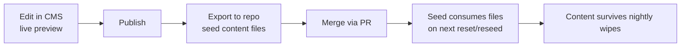

# Seeding

Deterministic seeding for the nightly reset (and local bootstrap). Goals, volumes, generation order, and the content-promotion loop. The reset itself is specified in [03-data-lifecycle.md](./03-data-lifecycle.md).

## Goals

1. **Identical corpus everywhere**: the same seed input produces the same data locally and in any deployed environment.
2. **Realistic-ish volumes** (below) so feeds, threads, profiles, and search feel lived-in.
3. **Idempotent**: reseeding over an existing seed corpus is a no-op (keyed upserts, no duplicates).
4. Runs from one script locally and remotely, driven by env-based base URLs — no environment-specific code paths.

## Volumes

| Entity       | Target                       | Notes                                                                          |
| ------------ | ---------------------------- | ------------------------------------------------------------------------------ |
| Users        | 10 (fixed)                   | `demo1`..`demo10`; profiles with varied display names/bios                     |
| Posts        | ~12 per user (~120 total)    | Mix of standalone posts and replies                                            |
| Follow graph | ~30% density                 | Each user follows ~3 of the other 9; guaranteed connected-ish, no self-follows |
| Replies      | A share of posts are replies | Concentrated on a few "conversation" threads                                   |
| Likes        | Distributed                  | Some posts hot, most cold                                                      |
| Reposts      | A few                        | Must produce repost feed entries                                               |
| Bookmarks    | A few                        | Scattered across users                                                         |
| Images       | A few posts                  | Attached to ready media assets                                                 |

## Determinism

- Faker (and any RNG) seeded with the constant **42** — recorded here as the contract.
- No `Date.now()`, randomness, or environment-derived values in generation; timestamps derive from a fixed epoch plus generated offsets.
- Generation order is fixed (below) so ids and references match across runs.

## Generation order

Feed and search are **not** written directly: the seed emits the same events the real services emit, and the fanout/index workers build derived stores exactly as in production. This exercises the event path and guarantees consistency.

## How seed runs

| Aspect       | Spec                                                                                                                 |
| ------------ | -------------------------------------------------------------------------------------------------------------------- |
| Entry point  | One script, invoked by the nightly reset (optional step) and by local bootstrap                                      |
| Targets      | Env-driven base URLs for each service API; same script local + remote                                                |
| Idempotency  | Keyed upserts (natural keys from the generator, e.g. `demo1/post-003`) — re-running over seeded data changes nothing |
| Failure      | Fail loudly and non-destructively; partial seeds are retried wholesale on the next run/reset                         |
| Verification | Post-seed sanity counts (users/posts/follow density) logged; mismatch marks the seed failed                          |

## Content promotion flow

Curated content must survive resets, so anything worth keeping is promoted **from CMS to repo**:

- Only CMS-managed content (landing intro, FAQ entries) participates; user posts are never promoted.
- Seed content files in the repo are the durable source; the CMS is the editing surface.
- A promotion is a PR like any other: reviewed, merged, then picked up by the next seed run.
