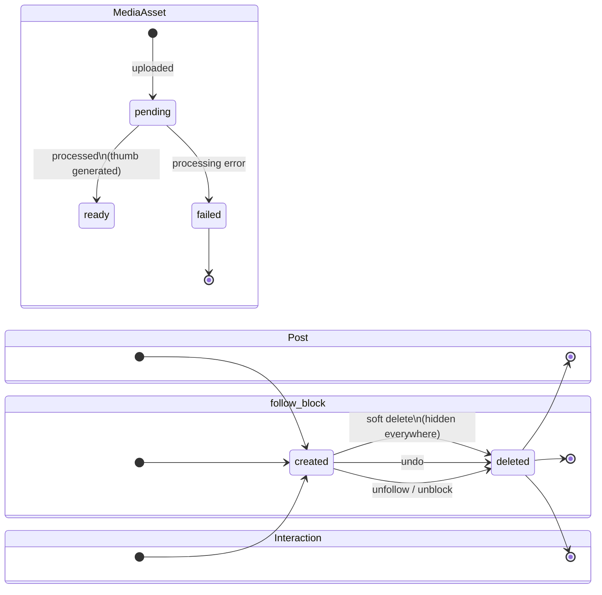

# Data Lifecycle

How entities live and die, the nightly reset, and retention. Storage details in [01-storage-model.md](./01-storage-model.md); the optional post-reset seed in [02-seeding.md](./02-seeding.md).

## Entity lifecycle states

Notes:

- **Post soft delete**: the row is marked `deleted` and hidden from feeds, threads, profiles, and search; hard removal happens at nightly reset. Replies to a deleted post remain but render the parent as removed.
- **MediaAsset `failed`** assets and unattached uploads are orphans: invisible to users, swept at reset (or opportunistically before).
- **FeedEntry** has no user-facing lifecycle: it appears when its source event arrives and is removed on post delete / unfollow fallout; wholesale reset clears it.

## Nightly reset

### Trigger

| Aspect   | Spec                                                             |
| -------- | ---------------------------------------------------------------- |
| Schedule | Configurable; default **00:00 UTC** daily                        |
| Step 1   | Wipe (below), in dependency order                                |
| Step 2   | Optional deterministic reseed ([02-seeding.md](./02-seeding.md)) |

### Scope — every store and what reset does to it

| Store                                                                   | Reset action                                                                                                       |
| ----------------------------------------------------------------------- | ------------------------------------------------------------------------------------------------------------------ |
| social Postgres                                                         | Truncate all tables (profiles, follows, blocks)                                                                    |
| posts Postgres                                                          | Truncate (posts, interactions)                                                                                     |
| media Postgres                                                          | Truncate (media assets)                                                                                            |
| feed Postgres                                                           | Truncate (feed entries)                                                                                            |
| search Postgres                                                         | Truncate (checkpoints)                                                                                             |
| cms Postgres                                                            | Truncate Payload _content_ tables only (landing intro, FAQ); CMS admin users/sessions are re-established, not lost |
| RustFS bucket `xitter-media`                                            | Wipe all objects (all `{userId}/...` keys)                                                                         |
| Kafka topics (`xitter.posts.v1`, `xitter.social.v1`, `xitter.media.v1`) | Reset consumer groups so workers resume from the new epoch (retained messages are not replayed)                    |
| OpenSearch                                                              | Delete the `posts` index (rebuilt empty or by reseed)                                                              |
| Keycloak                                                                | Recreate the demo realm (only synthetic demo accounts, `demo1`..`demo10`)                                          |
| Valkey                                                                  | Flush ephemeral keys (pub/sub channels, rate limits)                                                               |

### Ordering / dependencies

1. Pause/quiesce event consumption (workers) — avoid writing into stores being wiped.
2. Recreate Keycloak demo realm (identity must exist before any service call).
3. Truncate service DBs (any order among them; no cross-DB constraints).
4. Wipe RustFS bucket.
5. Delete OpenSearch index.
6. Reset Kafka consumer groups.
7. Flush Valkey.
8. Resume workers.
9. Optional: run deterministic seed ([02-seeding.md](./02-seeding.md)).
10. Emit reset-complete signal (with reseed status) for observability.

### Observability of the reset

- The reset job is instrumented like any service: per-step duration, success/failure, counts wiped.
- Reset completion (and reseed status) is surfaced in admin system health and reflected in user-facing copy expectations ([../product/02-features.md](../product/02-features.md)).
- A failed step halts the run, alerts, and leaves the system in a safe (empty or partially wiped) state rather than silently continuing.

## Retention

| Data                                                              | Retention                                                                                                     |
| ----------------------------------------------------------------- | ------------------------------------------------------------------------------------------------------------- |
| Kafka messages                                                    | 7 days (topic retention) — irrelevant to product state; consumer-group reset makes the nightly epoch boundary |
| Everything else (DBs, RustFS, OpenSearch, Valkey, Keycloak realm) | Until the nightly reset                                                                                       |
| Repo seed content files                                           | Indefinite (version-controlled); the only durable data ([02-seeding.md](./02-seeding.md))                     |

There is no other TTL, archival, or backup: nothing is precious, and privacy posture depends on wipes being final ([04-privacy.md](./04-privacy.md)).
