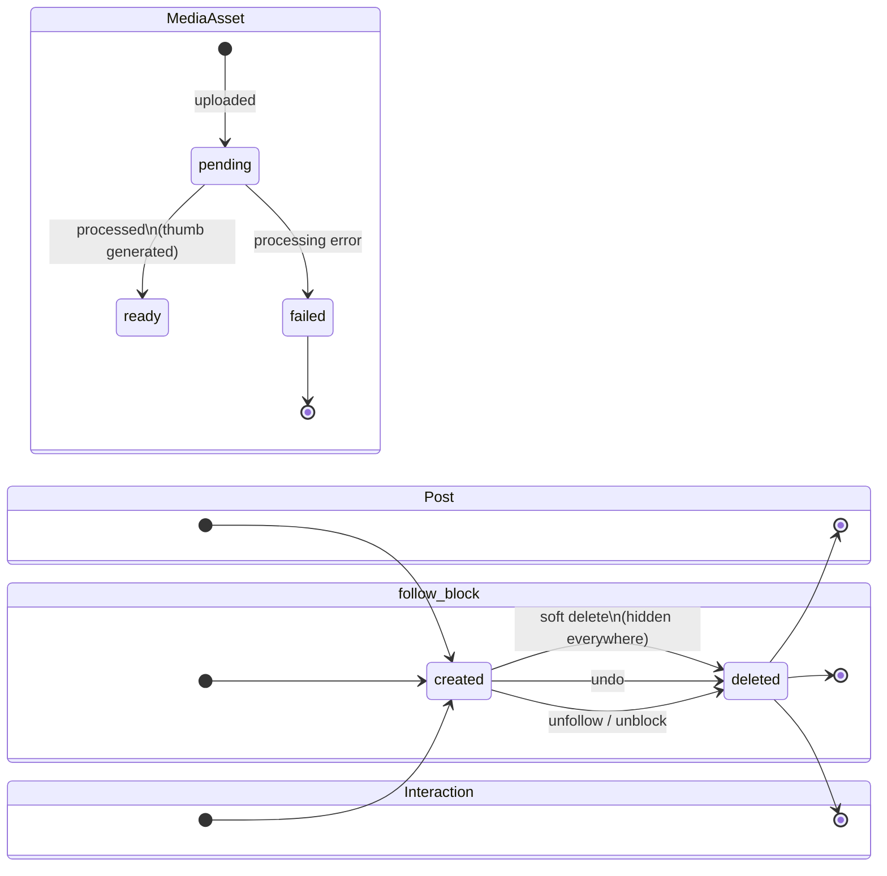

# Data Lifecycle

How entities live and die, the nightly reset, and retention. Storage details in [01-storage-model.md](./01-storage-model.md); the optional post-reset seed in [02-seeding.md](./02-seeding.md).

## Entity lifecycle states

Notes:

- **Post soft delete**: the row is marked `deleted` and hidden from feeds, threads, profiles, and search; hard removal happens at nightly reset. Replies to a deleted post remain but render the parent as removed.
- **MediaAsset `failed`** assets and unattached uploads are orphans: invisible to users, swept at reset (or opportunistically before).
- **FeedEntry** has no user-facing lifecycle: it appears when its source event arrives and is removed on post delete / unfollow fallout; wholesale reset clears it.

## Nightly reset

### Trigger

| Aspect   | Spec                                                                         |
| -------- | ---------------------------------------------------------------------------- |
| Schedule | Configurable; default **00:30 UTC** daily (offset from deploy churn windows) |
| Step 1   | Wipe (below), in dependency order                                            |
| Step 2   | Optional deterministic reseed ([02-seeding.md](./02-seeding.md))             |

### Scope — every store and what reset does to it

| Store                                                                   | Reset action                                                                                                                                                                                                                 |
| ----------------------------------------------------------------------- | ---------------------------------------------------------------------------------------------------------------------------------------------------------------------------------------------------------------------------- |
| social Postgres                                                         | Truncate all tables (profiles, follows, blocks)                                                                                                                                                                              |
| posts Postgres                                                          | Truncate (posts, interactions)                                                                                                                                                                                               |
| media Postgres                                                          | Truncate (media assets)                                                                                                                                                                                                      |
| feed Postgres                                                           | Truncate (feed entries)                                                                                                                                                                                                      |
| search Postgres                                                         | Truncate (checkpoints)                                                                                                                                                                                                       |
| cms Postgres                                                            | Truncate Payload _content_ tables only (landing intro, FAQ); CMS admin users/sessions are re-established, not lost                                                                                                           |
| RustFS bucket `xitter-media`                                            | Wipe all objects (all `{userId}/...` keys)                                                                                                                                                                                   |
| Kafka topics (`xitter.posts.v1`, `xitter.social.v1`, `xitter.media.v1`) | No reset action on the broker: workers seek to the log end when the reset clears its epoch, so retained messages are never replayed ([../../decisions/0010-reset-epoch-pause.md](../../decisions/0010-reset-epoch-pause.md)) |
| OpenSearch                                                              | Delete the `posts` index (rebuilt empty or by reseed)                                                                                                                                                                        |
| Keycloak                                                                | Recreate the demo realm (only synthetic demo accounts, `demo1`..`demo10`)                                                                                                                                                    |
| Valkey                                                                  | Flush ephemeral keys (pub/sub channels, rate limits); the reset then writes its epoch flag here                                                                                                                              |

### Ordering / dependencies

1. Stabilize the API services (#98): suspend their HPAs, pin the Deployments at 2 ready replicas — the join is spent before the run's own traffic starts so no pod boots mid-run (skipped locally).
2. Flush Valkey (clears any stale epoch state while workers are still live — harmless).
3. Set the reset epoch (an integer in Valkey); workers observe it and pause themselves.
4. Wait for every worker's pause acknowledgement (heartbeat key matching the epoch).
5. Recreate Keycloak demo realm (identity must exist before any service call).
6. Truncate service DBs (any order among them; no cross-DB constraints).
7. Wipe RustFS bucket.
8. Delete OpenSearch index.
9. Clear the reset epoch — workers seek to the log end (skipping the pre-reset backlog) and resume.
10. Optional: run deterministic seed ([02-seeding.md](./02-seeding.md)).
11. Restore the API services (unsuspend HPAs, 1 replica — the dev floor).
12. Emit reset-complete signal (with reseed status) for observability.

### Observability of the reset

- The reset job is instrumented like any service: per-step duration, success/failure, counts wiped (`xitter_reset_*` metrics — see [../operations/02-data-reset.md](../operations/02-data-reset.md)).
- Reset completion (and reseed status) is recorded to Valkey after every run and served by the feed service at `GET /api/feed/internal/reset-status`, surfaced in admin system health and reflected in user-facing copy expectations ([../product/02-features.md](../product/02-features.md)).
- A failed step halts the run, alerts, and leaves the system in a safe (empty or partially wiped) state rather than silently continuing. Workers are always resumed and the API services' autoscaling always restored, even on failure.

## Retention

| Data                                                              | Retention                                                                                                                                                     |
| ----------------------------------------------------------------- | ------------------------------------------------------------------------------------------------------------------------------------------------------------- |
| Kafka messages                                                    | 7 days (topic retention) — irrelevant to product state; workers skip the pre-reset log at every nightly epoch boundary (retained messages are never replayed) |
| Everything else (DBs, RustFS, OpenSearch, Valkey, Keycloak realm) | Until the nightly reset                                                                                                                                       |
| Repo seed content files                                           | Indefinite (version-controlled); the only durable data ([02-seeding.md](./02-seeding.md))                                                                     |

There is no other TTL, archival, or backup: nothing is precious, and privacy posture depends on wipes being final ([04-privacy.md](./04-privacy.md)).
