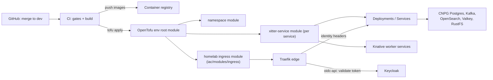

# Environments

## Environment model

| Env   | Purpose                                                      | Namespace / domain                                              | Data lifespan                                                                   | Auth notes                                                                                              |
| ----- | ------------------------------------------------------------ | --------------------------------------------------------------- | ------------------------------------------------------------------------------- | ------------------------------------------------------------------------------------------------------- |
| local | Developer laptops; full stack via docker compose + turbo dev | `xitter-${XITTER_ENV}` compose project, no cluster              | Disposable; wiped by `npm run reset`                                            | Local Keycloak (`xitter-demo` realm) at :8090; local Traefik edge mirrors cluster routing, no edge auth |
| dev   | Continuous-deployment target; demo/staging for merged work   | `xitter-dev` namespace; host-based ingress via homelab Traefik  | Disposable; nightly reset by default (see [02-data-reset.md](02-data-reset.md)) | Edge validates Keycloak OIDC tokens (`auth_mode: oidc-api`) and injects identity headers                |
| prod  | Stable public demo                                           | `xitter-prod` namespace; host-based ingress via homelab Traefik | Disposable; reset CronJob configurable per env (schedule/enable)                | Same edge auth as dev; only the `xitter-demo` realm is app-facing                                       |

All environments run the same images and topology; they differ only in Tofu vars, secrets, and reset scheduling.

## Deployment topology (cluster envs)

Both `dev` and `prod` are deployed identically from `infra/iac/environments/{dev,prod}`:

- Ingress module: `github.com/jdc-projects/homelab//iac/modules/ingress`, path-based routing, `auth_mode: oidc-api`.
- Tofu state: `kubernetes` backend with per-env `secret_suffix` (e.g. `xitter-dev`, `xitter-prod`).
- Kubeconfig convention: `kubeconfig = "../cluster.yml"` relative to each env directory.
- Shared operators: CNPG (Postgres), kafka-operator, opensearch-operator, valkey-operator; workers run on Knative.
- Observability stack (Grafana at `grafana.jd-chapman.dev`, Prometheus, Tempo, Sentry at `sentry.jd-chapman.dev`) is provisioned via Tofu CRs/providers; xitter dashboards and alert rules are part of dev work, not hand-configured.

## Config management

| Concern               | Mechanism                                                                                                             |
| --------------------- | --------------------------------------------------------------------------------------------------------------------- |
| Runtime config        | Environment variables only, named `XITTER_*` (e.g. `XITTER_ENV`, `XITTER_PORT_OFFSET`, DB/Kafka/OpenSearch endpoints) |
| Local defaults        | `.env` / `.env.example` contain **non-secret defaults only**                                                          |
| Secrets               | Tofu-managed Kubernetes secrets per env; never committed                                                              |
| Infrastructure vars   | Per-env `terraform.tfvars` / Tofu vars under `infra/iac/environments/{dev,prod}`                                      |
| Parallel local copies | `XITTER_ENV` scopes the compose project name; `XITTER_PORT_OFFSET` shifts all local ports so multiple stacks coexist  |

Local port map (base, before offset): web 3456, cms 3457, admin 3458, services 8101-8105, postgres 5532, kafka 9092, opensearch 9200, rustfs 9000, valkey 6379, keycloak 8090, edge 8080. The local edge (`infra/proxy/traefik`) mirrors cluster path routing so a service exercised at `localhost:8080` behaves like its deployed counterpart.

Local dependency lifecycle: `npm run deps:up` / `deps:down` / `deps:status`, `npm run bootstrap`, `npm run reset` / `reset:reseed`.

## Access control

| Action                             | Who                          | How                                                                                                                  |
| ---------------------------------- | ---------------------------- | -------------------------------------------------------------------------------------------------------------------- |
| Deploy (tofu apply), kubectl admin | Owner only                   | Homelab kubeconfig (`cluster.yml`) referenced from env dirs                                                          |
| Tofu state                         | Owner only                   | Kubernetes backend, per-env `secret_suffix`                                                                          |
| Keycloak administration            | Owner only                   | Admin realm via homelab Keycloak; the app only ever touches `xitter-demo` (see [02-data-reset.md](02-data-reset.md)) |
| Grafana / Sentry                   | Owner only                   | Homelab SSO; xitter dashboards/alerts read-only for everyone else                                                    |
| App end-users                      | Anyone with demo credentials | Edge-validated OIDC tokens; `demo1..demo10`                                                                          |

No shared accounts, no CI-held cluster credentials beyond what CI uses to deploy on merge to `dev`.
