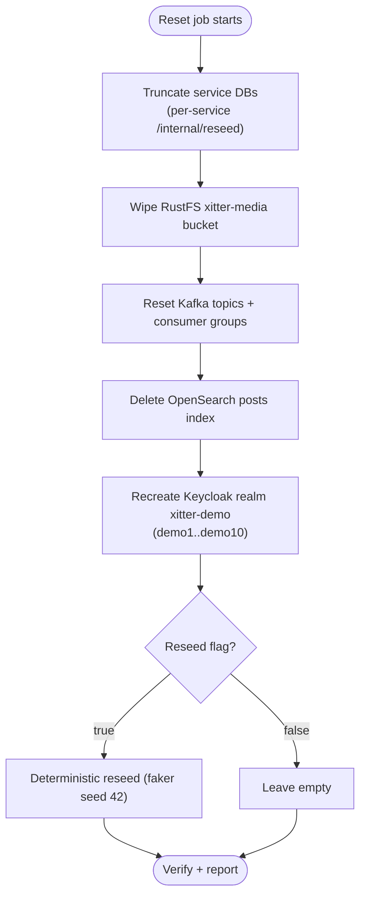

# Data Reset

Demo data is disposable by design: every environment can be wiped to a known state on a schedule. This spec defines the reset for cluster environments (`xitter-dev`, `xitter-prod`); locally the same flow is `npm run reset` / `npm run reset:reseed`.

## Schedule and triggering

| Aspect          | Behaviour                                                                                    |
| --------------- | -------------------------------------------------------------------------------------------- |
| Schedule        | Nightly at 00:00 UTC via Kubernetes CronJob                                                  |
| Configurability | Schedule is a Tofu variable on the reset CronJob resource (per env); reseed on/off is a flag |
| Manual trigger  | `kubectl -n xitter-<env> create job --from=cronjob/<reset-cronjob> <name>`                   |
| Idempotency     | Every step is safe to re-run; a repeated reset converges to the same state                   |

## Scope

| Store                       | Reset action                                                                                                                        | Mechanism                                                                            |
| --------------------------- | ----------------------------------------------------------------------------------------------------------------------------------- | ------------------------------------------------------------------------------------ |
| CNPG Postgres (service DBs) | Truncate all rows in every service database                                                                                         | Per-service `POST /internal/reseed` (performs truncation; reseed only when flag set) |
| RustFS                      | Empty the `xitter-media` media bucket                                                                                               | Bucket wipe (delete all objects)                                                     |
| Kafka                       | Remove topic records and delete consumer groups `xitter-fanout-worker`, `xitter-media-process-worker`, `xitter-search-index-worker` | Topic record deletion + consumer-group reset                                         |
| OpenSearch                  | Delete the `posts` index                                                                                                            | Index delete (recreated on next indexing event)                                      |
| Keycloak                    | Delete and recreate realm `xitter-demo` with users `demo1..demo10` (password `DemoPass123!`)                                        | Realm recreate via Keycloak admin API                                                |
| Optional reseed             | Deterministic content: faker seed `42`                                                                                              | Same reseed flag drives per-service `/internal/reseed` payload                       |

## Execution order

Order matters: identities must exist before reseeded content references them, and queues/indexes must be empty before new events flow.

## Reseed

- Controlled by the reset job's reseed flag (CronJob args), mirrored locally by `reset` vs `reset:reseed`.
- Faker seed is fixed at `42` so counts and content are deterministic and assertable.
- Curated content that should survive resets is promoted to repo seed files and replayed by reseed — see [03-backups.md](03-backups.md).

## Verification

| Check              | Expected                                                                               |
| ------------------ | -------------------------------------------------------------------------------------- |
| Job success metric | Reset job completion surfaced to Prometheus; alert fires on failure or missed schedule |
| Feed               | Empty after plain reset; known post/user counts after reseed (fixed by seed 42)        |
| Login              | `demo1` / `DemoPass123!` authenticates through the edge after realm recreate           |
| Search             | `posts` queries return nothing until reseeded content is re-indexed                    |
| Media              | `xitter-media` bucket object count is zero after reset                                 |

## Failure handling

| Concern           | Procedure                                                                                                                                                                |
| ----------------- | ------------------------------------------------------------------------------------------------------------------------------------------------------------------------ |
| Transient failure | Job retries (Kubernetes `backoffLimit`); steps are idempotent so a retry is safe                                                                                         |
| Alert             | Reset-failure alert (Prometheus rule) routes to the owner; job errors also appear in Sentry                                                                              |
| Partial reset     | Read job logs to find the last completed step, then re-trigger the job (or run the remaining steps manually) — the full run replays every step idempotently from the top |

Per repo convention, the step-by-step partial-reset runbook lives in `docs/runbooks`; this spec is the authoritative definition of the procedure the runbook follows.
