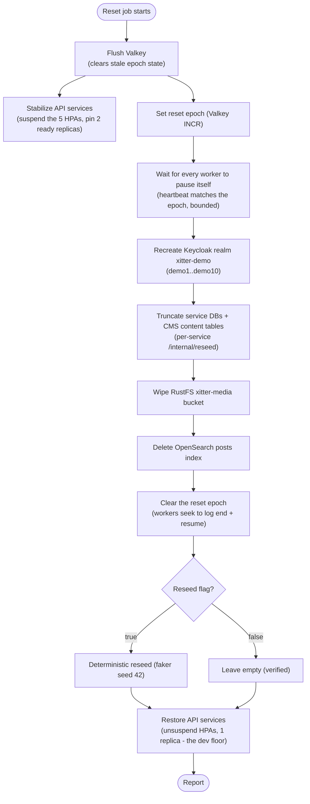

# Data Reset

Demo data is disposable by design: every environment can be wiped to a known state on a schedule. This spec defines the reset for cluster environments (`xitter-dev`, `xitter-prod`); locally the same flow is `npm run reset` / `npm run reset:reseed` (volume twin) and `npm run reset:live [--seed]` (the store-level flow itself, against a running stack).

## Schedule and triggering

| Aspect          | Behaviour                                                                                                                  |
| --------------- | -------------------------------------------------------------------------------------------------------------------------- |
| Schedule        | Nightly at 00:30 UTC via Kubernetes CronJob (`xitter-reset`) — offset from deploy churn windows (#82)                      |
| Configurability | Schedule is a Tofu variable on the reset CronJob resource (per env); reseed on/off is a Tofu variable driving the job args |
| Manual trigger  | `kubectl -n xitter-<env> create job --from=cronjob/xitter-reset xitter-reset-manual`                                       |
| Idempotency     | Every step is safe to re-run; a repeated reset converges to the same state                                                 |

## User provisioning ownership

Wipe+reseed has exactly one owner: the nightly reset. But user _existence_ must
not depend on it — any realm (re)creation (first deploy of a fresh environment,
a realm state heal) used to leave zero logins until the next nightly (#67).
The split:

| Concern                    | Owner                  | Mechanism                                                                                                                                                                                                                               |
| -------------------------- | ---------------------- | --------------------------------------------------------------------------------------------------------------------------------------------------------------------------------------------------------------------------------------- |
| Users EXIST                | The deploy path (Tofu) | One-shot `ensure-demo-users` Job (reset.tf), same `xitter-reset` image, `node dist/reset-job.js --ensure-users` — runs only the flow's realm-init step (`initDemoRealm`), an idempotent upsert that never wipes data or touches workers |
| Users are CLEAN + reseeded | The nightly reset      | Full flow: `resetDemoRealm` (users deleted) + `initDemoRealm` + store wipes + optional seed                                                                                                                                             |

The Job re-runs whenever its pod spec changes (CI pins `image_tag=sha-<short>`
per deploy, and the pod template is ForceNew in the kubernetes provider — the
same re-run semantics as `db-init`/`rustfs-provision`), and additionally via
`replace_triggered_by` whenever Tofu replaces the realm resources in an apply.

## Implementation

One code path everywhere: `packages/scripts` (`reset-flow.ts`) holds the flow; the CronJob image (`xitter-reset`) runs it with in-cluster coordinates (`reset-job.ts`), and local commands run the same functions against local ports. Differences are mechanical, not behavioural — in particular the worker pause is identical everywhere because the workers implement it themselves ([ADR 0010](../../decisions/0010-reset-epoch-pause.md)):

| Concern               | CronJob (cluster)                                                                                                                                                                                                                                                                                                                                                         | Local                                                                                                                                            |
| --------------------- | ------------------------------------------------------------------------------------------------------------------------------------------------------------------------------------------------------------------------------------------------------------------------------------------------------------------------------------------------------------------------- | ------------------------------------------------------------------------------------------------------------------------------------------------ |
| Store wipes           | `POST /internal/reseed`, bucket wipe, index delete, Valkey flush                                                                                                                                                                                                                                                                                                          | `npm run reset`: dependency volumes are destroyed (a superset); `npm run reset:live` performs the same store-level steps against a running stack |
| Worker pause + resume | The reset writes an epoch flag to Valkey; workers pause themselves on it and heartbeat their acknowledgement (`packages/events`)                                                                                                                                                                                                                                          | Identical (same Valkey, same worker code) - no worker is ever scaled or killed, locally or in-cluster                                            |
| API-service stability | `stabilize-services` / `restore-services` (#98): suspend the five API-service HPAs and pin their Deployments at 2 ready replicas for the wipe+seed window (the seed's burst used to trip the HPAs mid-run; the joining pod served 503s), then unsuspend and return to the 1-replica dev floor — minimal RBAC (get/patch on the five HPAs + `deployments/scale`, reset.tf) | Skipped with a warning (no HPAs locally; the steps report a visible skip)                                                                        |
| Kafka backlog skip    | Clearing the epoch makes each worker seek its assigned partitions to the log end before resuming                                                                                                                                                                                                                                                                          | Identical                                                                                                                                        |
| Realm                 | `resetDemoRealm` + `initDemoRealm` with the Tofu-managed client secrets injected                                                                                                                                                                                                                                                                                          | Same functions with local secrets                                                                                                                |
| Seed                  | `runSeed` (same corpus, faker 42)                                                                                                                                                                                                                                                                                                                                         | Same function (`npm run seed`, `reset:reseed`)                                                                                                   |

## Scope

| Store                       | Reset action                                                                                                                                                                                                                       | Mechanism                                                                                                                                                |
| --------------------------- | ---------------------------------------------------------------------------------------------------------------------------------------------------------------------------------------------------------------------------------- | -------------------------------------------------------------------------------------------------------------------------------------------------------- |
| CNPG Postgres (service DBs) | Truncate all rows in every service database                                                                                                                                                                                        | Per-service `POST /internal/reseed` (performs truncation; reseed only when flag set)                                                                     |
| cms Postgres                | Truncate Payload _content_ tables only (landing intro, FAQ); admin users/sessions are re-established, not lost                                                                                                                     | CMS content reset via Payload's own REST API + re-apply from repo seed files                                                                             |
| RustFS                      | Empty the `xitter-media` media bucket                                                                                                                                                                                              | Bucket wipe (delete all objects)                                                                                                                         |
| Kafka                       | No broker-side action: groups `xitter-fanout-worker`, `xitter-media-process-worker`, `xitter-search-index-worker` keep their offsets, but workers seek to the log end when the epoch clears (retained messages are never replayed) | The workers' own seek-to-log-end on resume ([ADR 0010](../../decisions/0010-reset-epoch-pause.md)) - replaces the old topic-recreate + group-delete step |
| OpenSearch                  | Delete the `posts` index                                                                                                                                                                                                           | Index delete (recreated on next indexing event)                                                                                                          |
| Keycloak                    | Delete and recreate realm `xitter-demo` with users `demo1..demo10` (password `DemoPass123!`)                                                                                                                                       | Realm recreate via Keycloak admin API, preserving Tofu-managed client secrets                                                                            |
| Valkey                      | Flush ephemeral keys (pub/sub channels, rate limits), then hold the reset epoch (`xitter:reset:epoch`) until the wipe completes                                                                                                    | Flush + epoch flag (the workers' pause/resume signal)                                                                                                    |
| Optional reseed             | Deterministic content: faker seed `42`                                                                                                                                                                                             | Same reseed flag drives the seed step                                                                                                                    |

## Execution order

Order matters: the flush must precede the epoch (it clears stale epoch state while workers are still live), the API services must be stabilized before the epoch is set (the HPA suspension and the second replica's join are spent up front, so no pod boots mid-run, #98), every worker must have acknowledged the epoch before any store is wiped, the epoch must clear before the seed so workers can consume seed events, and the services restore only after the last data-bearing step. This ordering is authoritative; [../data/03-data-lifecycle.md](../data/03-data-lifecycle.md) repeats it for the data view.

The implementation is `runResetFlow` in `packages/scripts/src/reset-flow.ts`; its step order is unit-tested against this diagram. A failed step halts the run after clearing the epoch **and restoring the API services** (so workers never stay paused and HPAs never stay suspended on a dead run — both are attempted best-effort in the failure path), and the Kubernetes `backoffLimit` retries the whole idempotent flow — the leading flush makes a retry safe against stale epoch state, and stabilize/restore replay idempotently on top of whatever partial state a failed attempt left.

The stabilization is **not** the pre-#81 worker quiesce ([ADR 0010](../../decisions/0010-reset-epoch-pause.md) still holds: workers pause themselves, nothing touches Knative or worker scaling). It exists because the seed's bursty load trips the five API-service HPAs mid-run; the pod that joins (prisma-migrate init container + Nest boot) is not ready when the seed's round-robin lands on it — the root cause behind the recurring "seed 503" nightly failures (#98). Locally the two steps run but report a visible skip (no Kubernetes API, no HPAs).

## Reseed

- Controlled by the reset job's reseed flag (CronJob args), mirrored locally by `reset` vs `reset:reseed` and `reset:live` vs `reset:live --seed`.
- Faker seed is fixed at `42` so counts and content are deterministic and assertable; the corpus digest (fingerprint) is recorded with every reseeded run.
- Curated content that should survive resets is promoted to repo seed files and replayed by reseed — see [03-backups.md](03-backups.md).
- Derived stores (feed, search) are rebuilt by the workers from the seed's Kafka events, never written directly — see [../data/02-seeding.md](../data/02-seeding.md).
- Seed service calls retry transient failures (502/503/504, connection refused) up to 3 times on a 2s backoff before failing the run (#82) — a deploy's pod-churn during the seed no longer wastes the night. The retry lives on the seed's call path only; the reset steps gain no new blanket retry (the truncate step keeps its own pre-existing bespoke retry for stale realm tokens).

## Verification

| Check              | Expected                                                                                                                  |
| ------------------ | ------------------------------------------------------------------------------------------------------------------------- |
| Job success metric | Reset job completion surfaced to Prometheus; alert fires on failure or missed schedule                                    |
| Feed               | Empty after plain reset (the flow verifies); known post/user counts after reseed (fixed by seed 42)                       |
| Login              | `demo1` / `DemoPass123!` authenticates through the edge after realm recreate                                              |
| Search             | `posts` queries return nothing until reseeded content is re-indexed                                                       |
| Media              | `xitter-media` bucket object count is zero after reset                                                                    |
| Status record      | `GET /api/feed/internal/reset-status` returns the last run (success, reseed flag, step timings) for the admin health tile |

## Observability

- **Alerts** ride kube-state-metrics job series (`job_name=~"xitter-reset.*"`): `XitterResetJobStale` (no successful run in 24h) and `XitterResetJobFailed` — the CronJob name `xitter-reset` is chosen to match those rules.
- **Metrics** `xitter_reset_*` (pushed to the Pushgateway when `XITTER_RESET_PUSHGATEWAY_URL` set; always logged): `xitter_reset_success`, `xitter_reset_duration_seconds`, `xitter_reset_reseeded`, `xitter_reset_step_duration_seconds{step,outcome}`, `xitter_reset_seed_fingerprint_info{fingerprint}`.
- **Status record**: after every run (success or failure) the flow writes a JSON record to Valkey (`xitter:reset:status`); the feed service serves it at `GET /api/feed/internal/reset-status`.

## Failure handling

| Concern           | Procedure                                                                                                                                                                |
| ----------------- | ------------------------------------------------------------------------------------------------------------------------------------------------------------------------ |
| Transient failure | Job retries (Kubernetes `backoffLimit`); steps are idempotent so a retry is safe                                                                                         |
| Alert             | Reset-failure alert (Prometheus rule) routes to the owner; job errors also appear in Sentry                                                                              |
| Partial reset     | Read job logs to find the last completed step, then re-trigger the job (or run the remaining steps manually) — the full run replays every step idempotently from the top |

Per repo convention, the step-by-step partial-reset runbook lives in `docs/runbooks`; this spec is the authoritative definition of the procedure the runbook follows.
