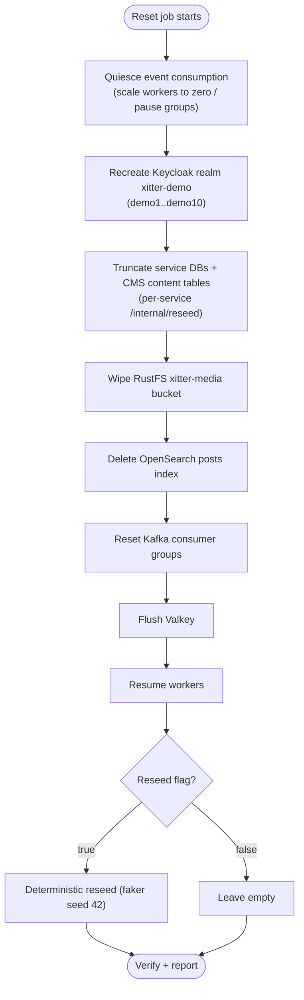

# Data Reset

Demo data is disposable by design: every environment can be wiped to a known state on a schedule. This spec defines the reset for cluster environments (`xitter-dev`, `xitter-prod`); locally the same flow is `npm run reset` / `npm run reset:reseed` (volume twin) and `npm run reset:live [--seed]` (the store-level flow itself, against a running stack).

## Schedule and triggering

| Aspect          | Behaviour                                                                                                                  |
| --------------- | -------------------------------------------------------------------------------------------------------------------------- |
| Schedule        | Nightly at 00:00 UTC via Kubernetes CronJob (`xitter-reset`)                                                               |
| Configurability | Schedule is a Tofu variable on the reset CronJob resource (per env); reseed on/off is a Tofu variable driving the job args |
| Manual trigger  | `kubectl -n xitter-<env> create job --from=cronjob/xitter-reset xitter-reset-manual`                                       |
| Idempotency     | Every step is safe to re-run; a repeated reset converges to the same state                                                 |

## Implementation

One code path everywhere: `packages/scripts` (`reset-flow.ts`) holds the flow; the CronJob image (`xitter-reset`) runs it with in-cluster coordinates (`reset-job.ts`), and local commands run the same functions against local ports. Differences are mechanical, not behavioural:

| Concern        | CronJob (cluster)                                                                              | Local                                                                                                                                                                                                                                                                         |
| -------------- | ---------------------------------------------------------------------------------------------- | ----------------------------------------------------------------------------------------------------------------------------------------------------------------------------------------------------------------------------------------------------------------------------- |
| Store wipes    | `POST /internal/reseed`, bucket wipe, index delete, group reset, Valkey flush                  | `npm run reset`: dependency volumes are destroyed (a superset); `npm run reset:live` performs the same store-level steps against a running stack                                                                                                                              |
| Worker quiesce | minScale 0 on the worker Knative Services (Kubernetes API, job RBAC), restored even on failure | Volume reset: the stack is down (inherently quiesced); live reset SIGTERMs the worker processes (found on their metrics ports) and restarts them via `npm run start:workers` - run the stack as `start:apps` + `start:workers` trees so this cannot cascade-kill the services |
| Realm          | `resetDemoRealm` + `initDemoRealm` with the Tofu-managed client secrets injected               | Same functions with local secrets                                                                                                                                                                                                                                             |
| Seed           | `runSeed` (same corpus, faker 42)                                                              | Same function (`npm run seed`, `reset:reseed`)                                                                                                                                                                                                                                |

## Scope

| Store                       | Reset action                                                                                                                                                                        | Mechanism                                                                                                                                                                                                                                                       |
| --------------------------- | ----------------------------------------------------------------------------------------------------------------------------------------------------------------------------------- | --------------------------------------------------------------------------------------------------------------------------------------------------------------------------------------------------------------------------------------------------------------- |
| CNPG Postgres (service DBs) | Truncate all rows in every service database                                                                                                                                         | Per-service `POST /internal/reseed` (performs truncation; reseed only when flag set)                                                                                                                                                                            |
| cms Postgres                | Truncate Payload _content_ tables only (landing intro, FAQ); admin users/sessions are re-established, not lost                                                                      | CMS content reset via Payload's own REST API + re-apply from repo seed files                                                                                                                                                                                    |
| RustFS                      | Empty the `xitter-media` media bucket                                                                                                                                               | Bucket wipe (delete all objects)                                                                                                                                                                                                                                |
| Kafka                       | Reset consumer groups `xitter-fanout-worker`, `xitter-media-process-worker`, `xitter-search-index-worker` so workers resume from the new epoch (retained messages are not replayed) | Topic recreation + group deletion: drained groups are deleted and every topic deleted + recreated (fresh log, offsets verifiably 0). kafkajs `resetOffsets` does NOT durably commit against Kafka 4 - pinning offsets at the log end is not achievable that way |
| OpenSearch                  | Delete the `posts` index                                                                                                                                                            | Index delete (recreated on next indexing event)                                                                                                                                                                                                                 |
| Keycloak                    | Delete and recreate realm `xitter-demo` with users `demo1..demo10` (password `DemoPass123!`)                                                                                        | Realm recreate via Keycloak admin API, preserving Tofu-managed client secrets                                                                                                                                                                                   |
| Valkey                      | Flush ephemeral keys (pub/sub channels, rate limits)                                                                                                                                | Flush                                                                                                                                                                                                                                                           |
| Optional reseed             | Deterministic content: faker seed `42`                                                                                                                                              | Same reseed flag drives the seed step                                                                                                                                                                                                                           |

## Execution order

Order matters: identities must exist before reseeded content references them, workers must be quiet before stores are wiped, and queues/indexes must be empty before new events flow. This ordering is authoritative; [../data/03-data-lifecycle.md](../data/03-data-lifecycle.md) repeats it for the data view.

The implementation is `runResetFlow` in `packages/scripts/src/reset-flow.ts`; its step order is unit-tested against this diagram. A failed step halts the run (after resuming workers), and the Kubernetes `backoffLimit` retries the whole idempotent flow.

## Reseed

- Controlled by the reset job's reseed flag (CronJob args), mirrored locally by `reset` vs `reset:reseed` and `reset:live` vs `reset:live --seed`.
- Faker seed is fixed at `42` so counts and content are deterministic and assertable; the corpus digest (fingerprint) is recorded with every reseeded run.
- Curated content that should survive resets is promoted to repo seed files and replayed by reseed — see [03-backups.md](03-backups.md).
- Derived stores (feed, search) are rebuilt by the workers from the seed's Kafka events, never written directly — see [../data/02-seeding.md](../data/02-seeding.md).

## Verification

| Check              | Expected                                                                                                                  |
| ------------------ | ------------------------------------------------------------------------------------------------------------------------- |
| Job success metric | Reset job completion surfaced to Prometheus; alert fires on failure or missed schedule                                    |
| Feed               | Empty after plain reset (the flow verifies); known post/user counts after reseed (fixed by seed 42)                       |
| Login              | `demo1` / `DemoPass123!` authenticates through the edge after realm recreate                                              |
| Search             | `posts` queries return nothing until reseeded content is re-indexed                                                       |
| Media              | `xitter-media` bucket object count is zero after reset                                                                    |
| Status record      | `GET /api/feed/internal/reset-status` returns the last run (success, reseed flag, step timings) for the admin health tile |

## Observability

- **Alerts** ride kube-state-metrics job series (`job_name=~"xitter-reset.*"`): `XitterResetJobStale` (no successful run in 24h) and `XitterResetJobFailed` — the CronJob name `xitter-reset` is chosen to match those rules.
- **Metrics** `xitter_reset_*` (pushed to the Pushgateway when `XITTER_RESET_PUSHGATEWAY_URL` set; always logged): `xitter_reset_success`, `xitter_reset_duration_seconds`, `xitter_reset_reseeded`, `xitter_reset_step_duration_seconds{step,outcome}`, `xitter_reset_seed_fingerprint_info{fingerprint}`.
- **Status record**: after every run (success or failure) the flow writes a JSON record to Valkey (`xitter:reset:status`); the feed service serves it at `GET /api/feed/internal/reset-status`.

## Failure handling

| Concern           | Procedure                                                                                                                                                                |
| ----------------- | ------------------------------------------------------------------------------------------------------------------------------------------------------------------------ |
| Transient failure | Job retries (Kubernetes `backoffLimit`); steps are idempotent so a retry is safe                                                                                         |
| Alert             | Reset-failure alert (Prometheus rule) routes to the owner; job errors also appear in Sentry                                                                              |
| Partial reset     | Read job logs to find the last completed step, then re-trigger the job (or run the remaining steps manually) — the full run replays every step idempotently from the top |

Per repo convention, the step-by-step partial-reset runbook lives in `docs/runbooks`; this spec is the authoritative definition of the procedure the runbook follows.
