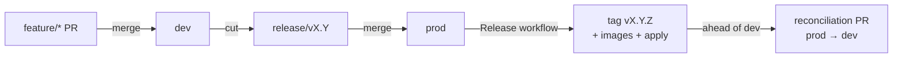

# Release Pipeline

Gitflow for xitter: `feature/*` → PR → `dev` → release branch → PR → `prod`, with semver-tagged releases promoted from dev to prod and reconciliation flowing prod-only commits back to dev.

## Branch model

| Branch      | Role                                                                 | Deploy trigger                      |
| ----------- | -------------------------------------------------------------------- | ----------------------------------- |
| `dev`       | Integration; continuous deployment of every merge                    | `push` → Deploy dev (images `:dev`) |
| `release/*` | Stabilisation branch cut from `dev` when a release is decided        | none (merges into `prod`)           |
| `prod`      | Released state; every merge is a semver release                      | `push` → Release workflow           |
| `feature/*` | Work branches; PRs target `dev` (occasionally `release/*` for fixes) | none                                |

Promoting a release:

1. Cut a release branch from `dev` (`git checkout -b release/v0.2 dev && git push origin release/v0.2`). Naming: `release/vX.Y` (the patch is decided at release time).
2. Optionally stabilise: cherry-pick or commit fixes on the release branch.
3. Open a PR `release/vX.Y` → `prod` (subject to prod branch protection: PR gates + the Release workflow is the only deploy path). Merge.
4. The [Release workflow](#release-workflow) derives the version, publishes images, tags, deploys prod, and reconciles.

## Versioning (semver + conventional commits)

Versions are **derived from the conventional-commit history** since the last `v*` tag (`packages/scripts/src/release-version.ts`), not from a `workflow_dispatch` input. Rationale: the repo already mandates conventional commits for every PR, so the derivation is auditable (tag → compare range → commit list) and cannot drift from what actually shipped; a manual input is a second source of truth that silently disagrees with history. An explicit `--explicit vX.Y.Z` override exists for dry runs and repairs, and the workflow rejects versions that are not greater than the latest tag.

| History since last tag                 | Bump (major ≥ 1) | Bump (0.x) |
| -------------------------------------- | ---------------- | ---------- |
| any `!` / `BREAKING CHANGE:` footer    | major            | **minor**  |
| any `feat`                             | minor            | minor      |
| only `fix` / `perf` / chores / nothing | patch            | patch      |
| no previous tag (first release)        | `0.1.0`          | —          |

While the major is `0`, breaking changes bump the **minor** (pre-1.0 semver convention: `0.x.y` signals instability; the minor is the "major-like" component).

- **Images**: every release publishes `ghcr.io/jdc-projects/xitter-{app}:vX.Y.Z` (immutable) plus `:sha-<short>` for traceability. Prod never deploys a mutable tag — `infra/iac/environments/prod` takes `image_tag` as a **required variable with no default**, so a dev value (`dev` tag) can never leak into prod by omission. Dev keeps its mutable `:dev` tag (continuous deployment).
- **Release notes**: generated from the same commit range (grouped breaking/features/fixes/internal with compare link) and attached to the GitHub release; the derivation summary is a workflow artifact.
- The repo-root `version` field stays `0.0.0` on purpose — releases version **deployed images**, not the npm workspace (nothing is published to a registry).

## Release workflow (`.github/workflows/release.yml`)

Triggered by `push` to `prod` (a release-branch merge) and by `workflow_dispatch` (dry runs).

| Job              | What it does                                                                                                                                                                                                    |
| ---------------- | --------------------------------------------------------------------------------------------------------------------------------------------------------------------------------------------------------------- |
| `version`        | Derives the next version (or takes the explicit input), uploads the derivation + notes artifact.                                                                                                                |
| `release-images` | Builds + pushes all 11 images tagged `vX.Y.Z` + `sha-<short>` (GHA cache per image).                                                                                                                            |
| `github-release` | `gh release create` with the generated notes, target = released SHA. Skipped on dry runs.                                                                                                                       |
| `tofu-apply`     | `tofu apply` on `infra/iac/environments/prod` with `-var image_tag=vX.Y.Z`. Dry runs plan instead (detailed exit code 2 = changes = pass) and upload the plan. Self-hosted runner — the cluster API is private. |
| `reconcile`      | Opens a `prod` → `dev` PR when `prod` holds commits `dev` lacks.                                                                                                                                                |

Reconciliation cases:

- **Normal release**: the merge commit exists only on `prod` → a reconciliation PR flows it back to `dev` (merge as admin; the PR is bot-authored so it does not trigger gates — see [manual steps](#manual-configuration-branch-protection)).
- **Fast-forward release** (dev merged into prod with no extra commits): nothing to reconcile; the job reports "no reconciliation needed".
- **Stabilisation fixes made on the release branch**: carried by the same reconciliation PR.

The reconciliation path is **exercised by the first release** (v0.1.0): a merge commit on `prod` that `dev` lacks opens the PR — see the runbook for the observed behaviour.

## Prod environment

`infra/iac/environments/prod` mirrors dev's topology (same modules, same file layout) with deliberate deltas:

| Concern          | dev                                                                      | prod                                                                      |
| ---------------- | ------------------------------------------------------------------------ | ------------------------------------------------------------------------- |
| Domain           | `xitter-dev.jd-chapman.dev`                                              | `xitter.jd-chapman.dev`                                                   |
| Image tag        | mutable `dev` (default)                                                  | **required** `image_tag` var — always an explicit release                 |
| Postgres (CNPG)  | 1 instance                                                               | 2 instances (supervised switchover rolls)                                 |
| OpenSearch       | 2 nodes (forced by the operator's restart guard; zero failure tolerance) | 3 nodes (majority quorum; tolerates one node down)                        |
| Sentry           | owns the single `xitter` project (team `xitter`)                         | reads the same project via data sources; events tagged `environment=prod` |
| Alerts           | incl. reset-job rules                                                    | same SLOs, env-interpolated; reset rules land with #13's prod wiring      |
| Dashboards       | 4 (incl. reset job)                                                      | the 3 env-agnostic dashboards rendered from dev's JSON files              |
| Reset (CronJob)  | nightly 00:00 UTC (#13)                                                  | deferred to #13's follow-up (schedule/enable per env is its variable)     |
| Keycloak clients | incl. `svc-reset`                                                        | no `svc-reset` until the reset job exists in prod                         |

**Ingress/realm wiring**: same host-based edge routing via the homelab ingress module — `/api/{service}` (oidc-api against the `xitter-demo` realm), `/cms` + `/admin` (oidc-interactive against `primary`), `/` + `/media` unauthenticated, plus the unauthenticated `/xitter-media` presign route. No dev values leak: the only literal domains are `var.domain` (`xitter.jd-chapman.dev`), the Keycloak host from homelab remote state, and in-cluster service DNS. The geo-open Keycloak path routes on `idp.jd-chapman.dev` use priority **190** (dev's are 200): dev's identical matchers win while dev exists, and prod's remain armed standbys so global demo login survives if dev is ever destroyed.

## Scheduled suites (`.github/workflows/scheduled.yml`)

Nightly at **02:30 UTC** — after the 00:00 UTC reset/reseed window — against the freshly reseeded dev environment:

| Suite     | Command                                                                                         | Reporting                                          |
| --------- | ----------------------------------------------------------------------------------------------- | -------------------------------------------------- |
| Bruno     | `npm run test:api -- --env dev` (the deployed dev env)                                          | `bruno-report-dev` artifact (14-day retention)     |
| Artillery | `npx artillery run tests/artillery/feed-flow.yml` (modest phases: 30s warm-up + 2m ramp 2→10/s) | `artillery-report-dev` artifact (14-day retention) |

Both target the public edge (`https://xitter-dev.jd-chapman.dev`, Keycloak at `https://idp.jd-chapman.dev`) — no cluster credentials involved. Failures surface as the workflow run status (visible from the Actions tab; no separate paging — the observability alerts own production health). `workflow_dispatch` accepts `environment: dev|prod` for on-demand runs, including pre-release smoke against prod.

`npm run test:api` against the **local** stack is wired into `npm run check:all` as `check:api` (the Bruno suite needs a running local stack — deps + bootstrap — same as e2e).

## Manual configuration: branch protection

Branch protection cannot be set from this repo's code (owner-only, via repo settings). Required settings:

**`dev`** — require PR before merge:

- Required checks: `format`, `gates`, `repo-analysis`, `playwright-web`, `e2e`, `mutation`, `tofu`, `tofu-plan` (when infra changed)
- Require branches up to date; disallow force pushes; allow force pushes: off; restrictions: none (any collaborator)
- `Deploy dev` runs on merge (no additional protection needed)

**`prod`** — release path only:

- Require PR before merge, approvals ≥ 1
- Required checks: same PR gate set (release branches are PR'd from dev, so gates run)
- Disallow force pushes; **do not** add the Release workflow as a check — it runs after merge by design
- Restrictions: owner only (releases are an owner action)

**`release/*` pattern** — optionally protected like `dev` (no direct pushes once shared).

Verification (owner): `gh api repos/jdc-projects/xitter/branches/dev/protection` and `.../prod/protection` reflect the above after configuration.

## First-release checklist

1. Configure branch protection (above).
2. Dry-run: Actions → Release → Run workflow with `dry_run=true`, `version=v0.1.0-rc.1` — verify the prod **plan** artifact is complete and non-destructive.
3. Cut `release/v0.1` from dev, PR → `prod`, merge.
4. Watch the Release run: tag `v0.1.0`, images on GHCR, prod apply, reconciliation PR.
5. Merge the reconciliation PR; `git rev-list --count origin/prod ^origin/dev` → `0`.

## Related

- [01-environments.md](01-environments.md) — environment model and topology
- [02-data-reset.md](02-data-reset.md) — nightly reset (scheduled suites run after it)
- `docs/runbooks/06-releasing.md` — step-by-step release runbook
