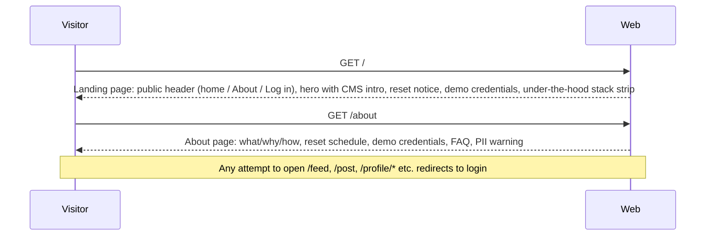
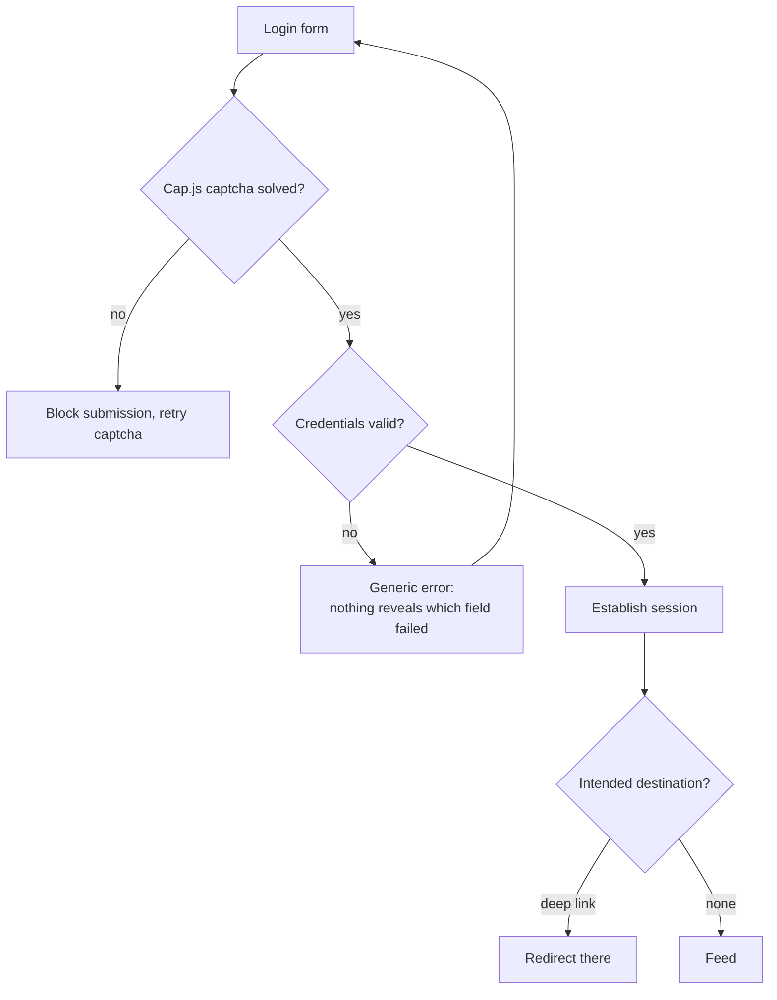
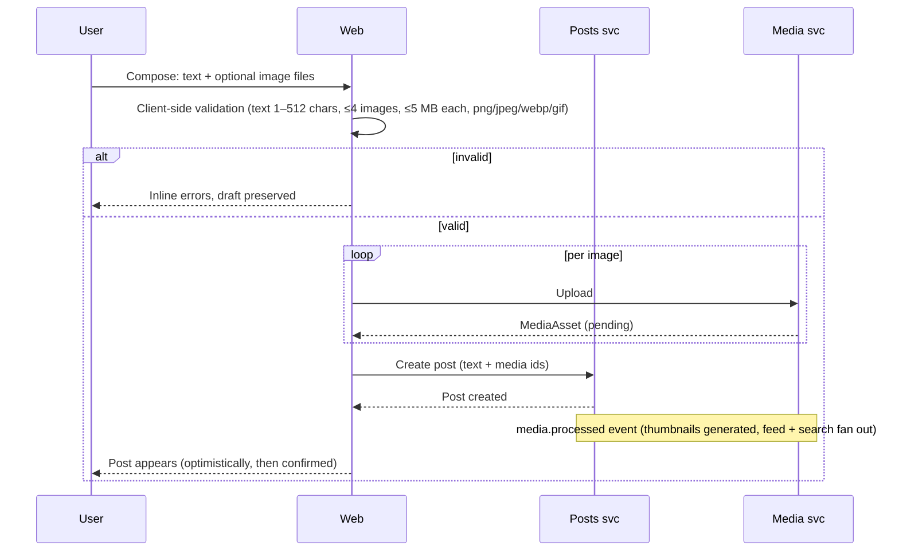
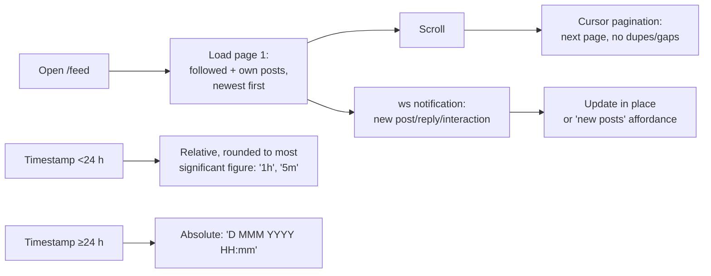
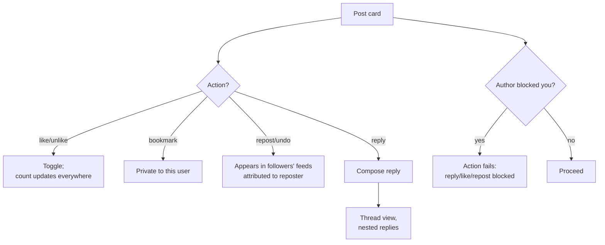
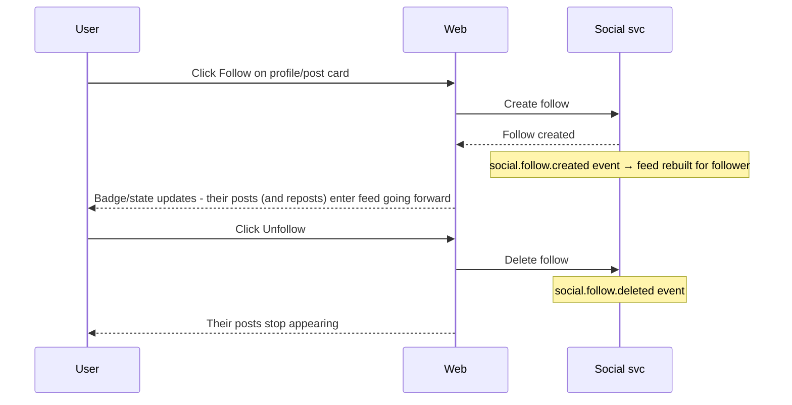
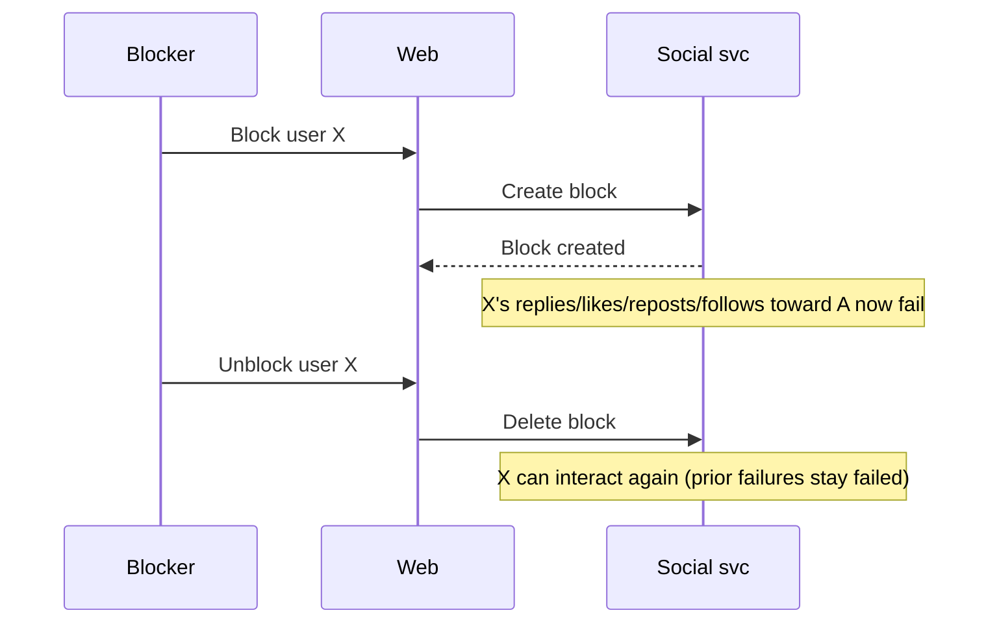
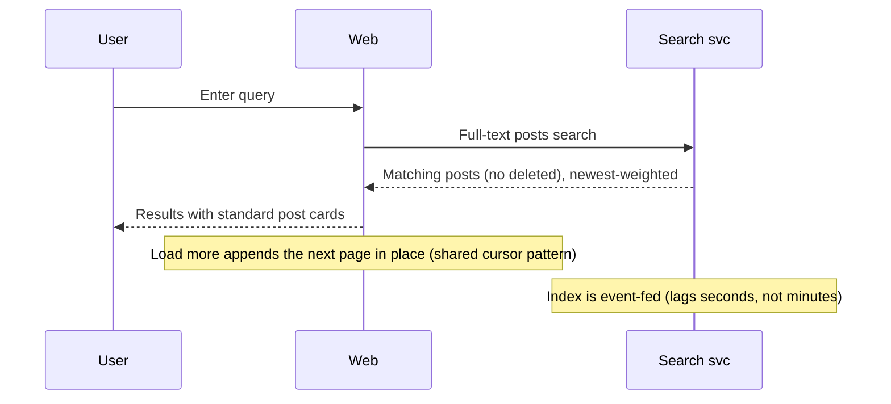
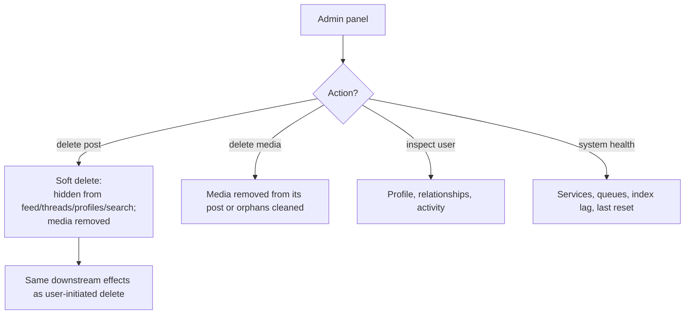

# User Flows

Step-by-step flows with diagrams, including error and edge cases. Acceptance criteria for each feature live in [02-features.md](./02-features.md); this doc covers the _sequence_ of interactions.

## 1. First-time visitor

Edge cases: deep links to user content while unauthenticated → redirect to login, then return to the target after successful login.

## 2. Login

Failure states: invalid demo username, wrong password, captcha failure/expiry, session expiry mid-use (re-authenticate and resume).

## 3. Posting with image

Edge cases: upload fails → post creation blocked, images from failed upload are orphaned and cleaned up; server-side re-validation rejects anything the client missed, draft preserved; post with images still pending processing shows originals/placeholder until ready.

## 4. Consuming the feed

Edge cases: followed account deletes a post (removed on next load/notification); user follows someone mid-session (their posts appear going forward; backfill per feed rules); empty feed state (prompt to follow accounts or post).

## 5. Engaging (like / reply / repost / bookmark)

Edge cases: double-click like (idempotent — unique per user+post+kind); interacting with a post deleted moments ago (404, UI removes it); undo of each interaction returns counts to prior state.

## 6. Following / unfollowing

Edge cases: follow someone who blocked you → fails (block semantics); follow a private-nothing demo account — all accounts are equal, no approval flow; following lists visible on any profile.

## 7. Blocking

Semantics: blocking is one-directional enforcement — X cannot interact with A or A's posts, and cannot follow A. A's view hides X's content where feasible. Unblock does not retroactively create anything.

## 8. Searching

Edge cases: empty query (no search fired); post deleted since indexing (excluded on next index update, tolerated if briefly stale); no results state.

## 9. Admin moderation

Edge cases: deleting a post that already has replies (replies remain but reference a hidden/removed post, rendered gracefully); concurrent user interaction with a post being deleted (last write wins, delete dominates).

## Cross-cutting edge cases

| Situation                                   | Behaviour                                                                                            |
| ------------------------------------------- | ---------------------------------------------------------------------------------------------------- |
| Nightly reset mid-session                   | Session survives (identity is external); data disappears; UI degrades gracefully, empty states shown |
| Any failure                                 | Inline, human error message; drafts preserved where possible                                         |
| Unauthenticated API/web access to user data | Redirect to login (web) / 401 (API)                                                                  |
