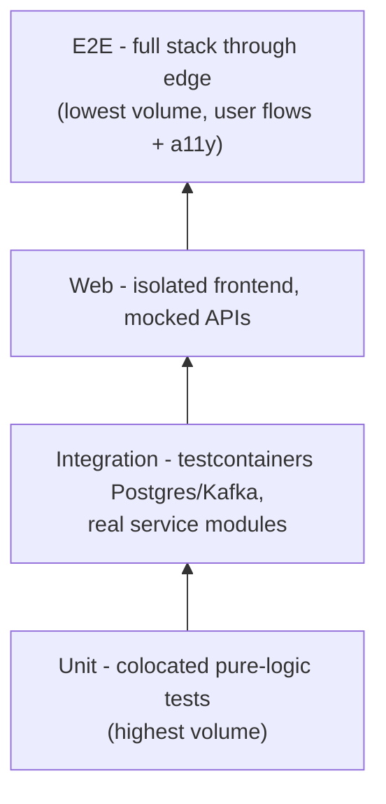

# Testing Strategy

## Philosophy

- Testing is first-class: features are not done until their tests exist and pass.
- Test **outcomes, not implementation**: assert on observable behaviour (HTTP responses, rendered UI, emitted events), never on internal structure. Refactors that preserve behaviour must not break tests.
- Coverage is pushed **where it adds value** — domain logic, service endpoints, worker event handling — not for its own sake. No suite string-checks config files to fake coverage.
- Everything reasonable gets covered; genuinely low-value surfaces (skeletons, entrypoint wiring) are explicitly exempt ([03-coverage-and-gates.md](03-coverage-and-gates.md)).

## Test targets rules

| Rule                                                              | Reason                                                                    |
| ----------------------------------------------------------------- | ------------------------------------------------------------------------- |
| **No automated suite runs against dev mode**                      | Watch-mode processes are non-deterministic (partial builds, reload races) |
| Unit + integration run **against source** (tsx, no build)         | Fast feedback, no build dependency                                        |
| Web and e2e suites run **against built (prod-like) artifacts**    | Test what ships; config `webServer` builds/starts them automatically      |
| Load tests run against **prod-like local stack or deployed envs** | Absolute numbers are only meaningful on realistic builds                  |

## Test pyramid

Volume decreases upward; speed and isolation decrease with it. Prefer pushing a case as far down the pyramid as it still meaningfully verifies. Load, mutation, and API smoke run outside the pyramid as specialized gates ([02-suites.md](02-suites.md)).

## Suite ownership matrix

| Concern                           | Unit     | Integration | Web      | E2E               | Load     | Mutation |
| --------------------------------- | -------- | ----------- | -------- | ----------------- | -------- | -------- |
| Pure/domain logic                 | **Owns** | Supplements | –        | –                 | –        | Scores   |
| DB schema, queries, migrations    | –        | **Owns**    | –        | –                 | –        | Scores   |
| Kafka event produce/consume       | –        | **Owns**    | –        | –                 | –        | Scores   |
| API contract compliance           | –        | **Owns**    | –        | Smoke             | –        | –        |
| UI rendering + interaction        | –        | –           | **Owns** | Verifies journeys | –        | –        |
| Auth, blocking, search end-to-end | –        | –           | Mocked   | **Owns**          | Sustains | –        |
| Accessibility (WCAG 2.2 AA)       | –        | –           | Basics   | **Owns** (axe)    | –        | –        |
| Throughput/latency SLAs           | –        | –           | –        | –                 | **Owns** | –        |
| Test-suite quality itself         | –        | –           | –        | –                 | –        | **Owns** |

## Flakiness policy

- Flaky tests are treated as bugs, not noise: fix or remove; never blanket-retry locally.
- Retries are configured **in CI only** (Playwright / Vitest CI retries), capped small.
- A test that still flakes gets a quarantine tag/annotation and an owning ticket; quarantined tests don't block gates and are excluded from counts until fixed.

## Deterministic time

- Feed/timeline and other timestamp logic is unit-tested with a **fixed `now`** injected/mocked — never `Date.now()` read directly inside logic under test.
- Tests never depend on wall-clock ordering, sleeps, or time-of-day; integration tests set explicit timestamps when asserting ordering.
